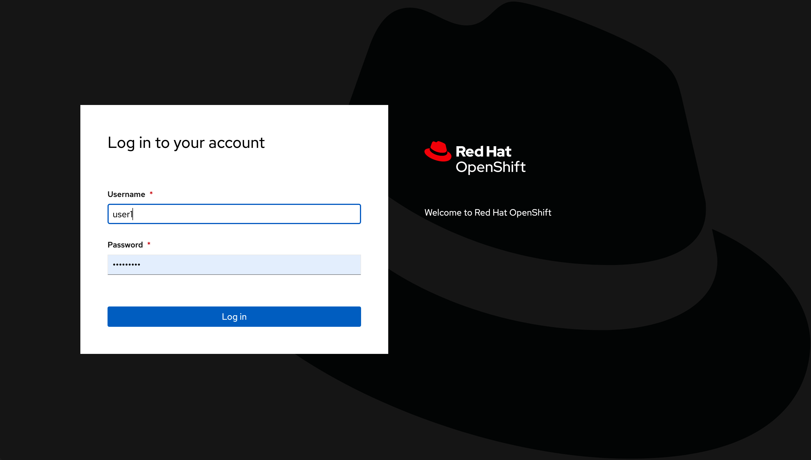
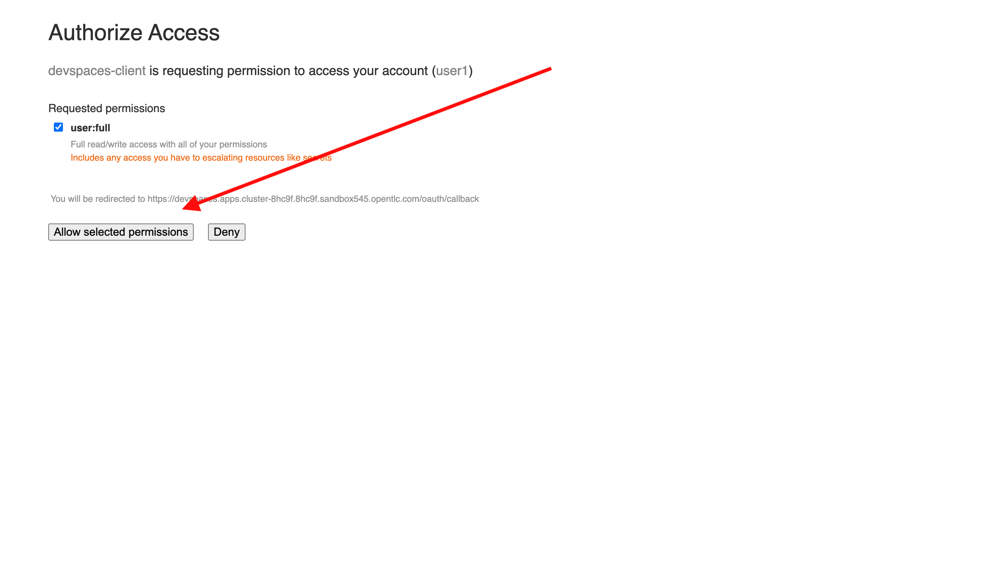
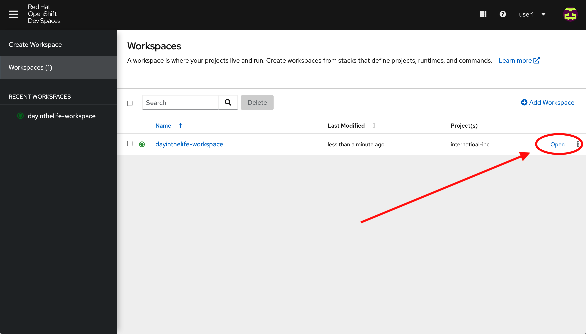
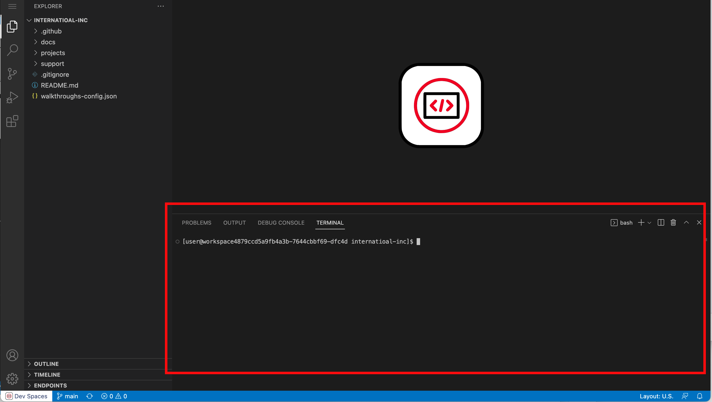
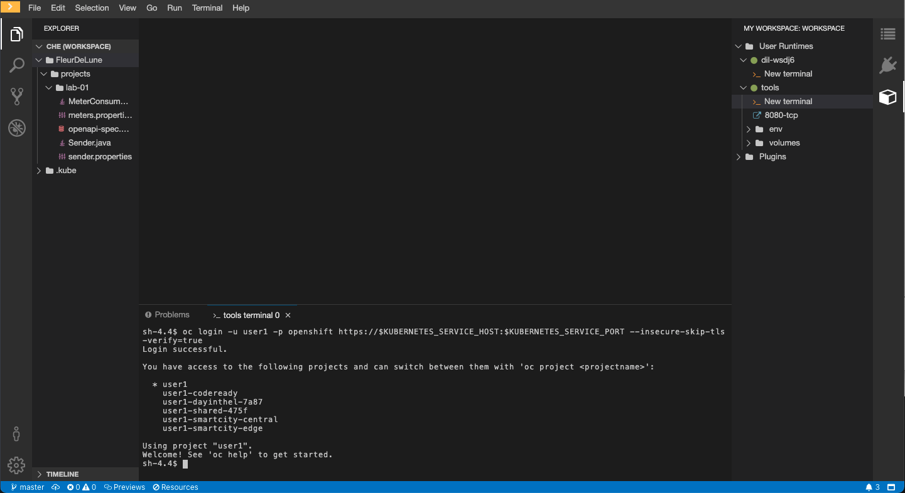
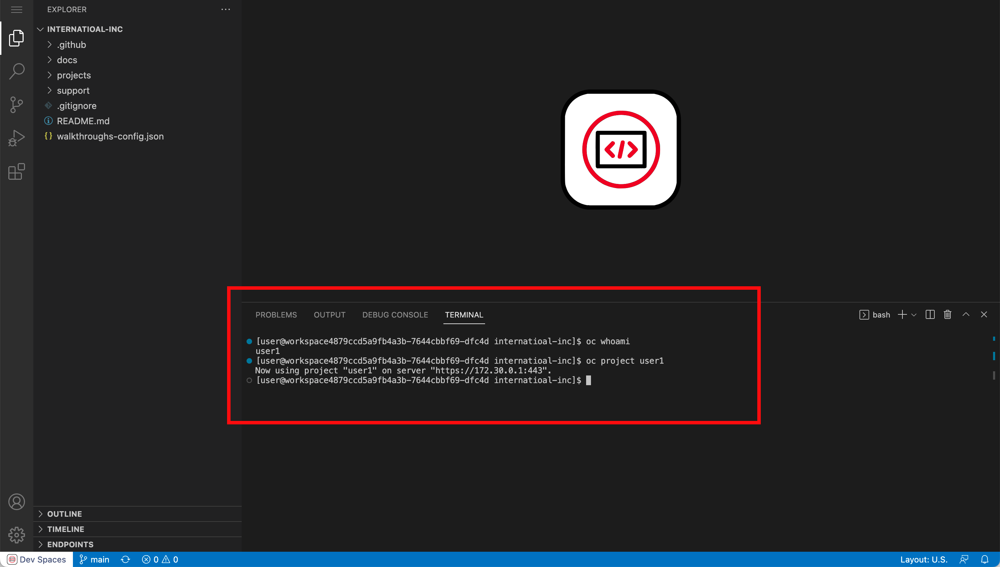

// Attributes
:walkthrough: Getting Ready for the Labs
:title: Lab 0 - {walkthrough}
:user-password: openshift
:standard-fail-text: Verify that you followed all the steps. If you continue to have issues, contact a workshop assistant.
:namespace: {user-username}

// URLs
:codeready-url: https://devspaces.{openshift-app-host}/
:openshift-streams-url: https://console.redhat.com/beta/application-services/streams/kafkas

[id='getting-ready']
= {title}

The following instructions introduce you to your development environment, and the cluster where you'll deploy your applications throughout this workshop.

*Overview*

Built on the open Eclipse Che project, Red Hat OpenShift Dev Spaces uses Kubernetes and containers to provide any member of the development or IT team with a consistent, secure, and zero-configuration development environment. The experience is as fast and familiar as an integrated development environment on your laptop.

OpenShift Dev Spaces is included with your OpenShift subscription and is available in the Operator Hub. It provides development teams a faster and more reliable foundation on which to work, and it gives operations centralized control and peace of mind.

[type=walkthroughResource,serviceName=codeready]
.Red Hat OpenShift Dev Spaces
****
* link:{codeready-url}[Console, window="_blank", , id="resources-codeready-url"]
****
[type=walkthroughResource]
.Red Hat OpenShift Developer Console
****
* link:{openshift-host}/topology/ns/{namespace}[Topology View, window="_blank"]
****
[type=walkthroughResource]
.Red Hat OpenShift Application Services
****
* link:{openshift-streams-url}[Streams for Apache Kafka, window="_blank"]
****
[type=walkthroughResource]
.Credentials
****
* *username:* `{user-username}`
* *password:* `{user-password}`
****

:sectnums:

[time=5]
== Accessing a Development Environment

The development environment you use throughout the workshop is a web-hosted IDE known as link:https://developers.redhat.com/products/codeready-workspaces/overview[Red Hat OpenShift Dev Spaces, window="_blank"].

=== Login to OpenShift Dev Spaces

To access your development environment:

. Click the link:{codeready-url}[Console, window="_blank"] link under the *Red Hat OpenShift Dev Spaces* in the *Resources* panel on the right.
. Log in using your username (`{user-username}`) and password (`{user-password}`)
+

. If this is the first time logging in, you will need to authorize access to your account.
+

. Once you are logged in, you'll see the OpenShift Dev Spaces dashboard. This lists available workspaces.
+
image::images/00-crw-dashboard.png[OpenShift Dev Spaces Dashboard, role="integr8ly-img-responsive"]

=== Accessing your OpenShift Dev Spaces Workspace

This workshop provides a single, pre-configured workspace with plugins, source code, and even container images that have various Command-Line Interface (CLI) tools installed.

. Click the *Open* link for the workspace named `dayinthelife-workspace`.
+

. This will start an instance of the workspace. Please wait a few moments while it downloads the required container images and configuration setup.
. Close the welcome tab by clicking the *x*, then click on the Explorer (file) icon on the left side bar. The Explorer shows you the *International Inc* folder with the required projects and lab files.
+
image::images/01-crw-welcome.png[OpenShift Dev Spaces Welcome screen, role="integr8ly-img-responsive"]
+
[NOTE]
====
This IDE is based on Microsoft's VS Code. It will look familiar if you have already used it.
====

[time=2]
== Accessing a Terminal

During the workshop you will use the OpenShift CLI along with other developer-focused Command Line Interface (CLI) tools.
These CLI tools are available directly inside your Workspace via containers.

Access the tools container like so:

. Click on the *Menu* (_hamburger icon_) on the right side panel.
. Expand the *Terminal* folder.
. Click on *New terminal*.

{blank}

image::images/02-crw-tools-container.png[Open Terminal, role="integr8ly-img-responsive"]

{blank}

A terminal window should be open at the bottom of the screen. This terminal is attached to the running OpenShift Dev Spaces container and is also running on OpenShift. This is the place where you will issue most of the commands from this workshop.

{blank}

[time=2]
== Login into OpenShift using the CLI

. Open a terminal using the instructions from the previous section.
. Check that you are logged in with your user:
+
[source,bash,subs="attributes+"]
----
oc whoami
----
+
{blank}
+
You should see something like the following:
+
[subs="attributes+"]
----
{user-username}
----
.. In case you are not logged in and you need to login into the terminal, issue the following command:
+
[source,bash,subs="attributes+"]
----
oc login -u {user-username} -p {user-password} https://$KUBERNETES_SERVICE_HOST:$KUBERNETES_SERVICE_PORT --insecure-skip-tls-verify=true
----
+
{blank}
+
[NOTE]
====
You can use the right copy button to copy this type of commands along all the lab instructions.
====
.. You should see something like the following (the project names may be different):
+
[subs="attributes+"]
----
Login successful.

You have access to the following projects and can switch between them with 'oc project <projectname>':

  * {user-username}
    {user-username}-codeready
    {user-username}-dayinthel-7a87
    {user-username}-shared-475f
    {user-username}-smartcity-central
    {user-username}-smartcity-edge

Using project "user1".
Welcome! See 'oc help' to get started.
----
+
{blank}
+

. Most of the work will be deploy to your own `{namespace}` project namespace, so be sure to have it as a _working_ project by executing the following command:
+
[source,bash,subs="attributes+"]
----
oc project {namespace}
----
+
{blank}
+

Now you are ready to start working on the application services!

