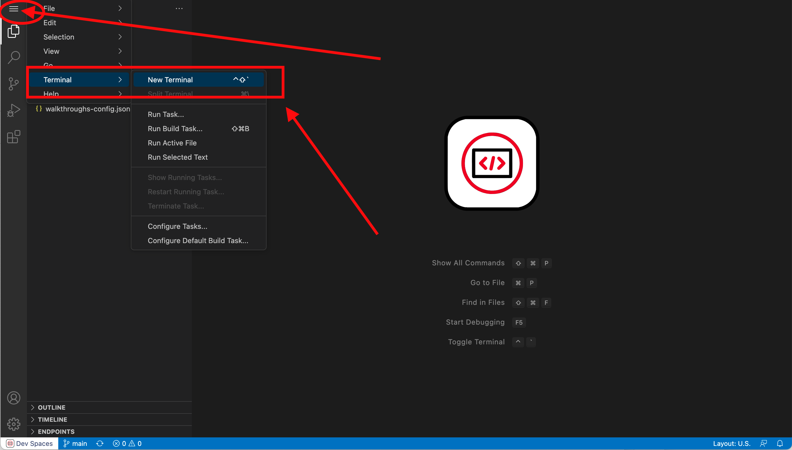

// Attributes
:walkthrough: Getting Ready for the Labs
:title: Lab 0 - {walkthrough}
:user-password: openshift
:standard-fail-text: Verify that you followed all the steps. If you continue to have issues, contact a workshop assistant.
:namespace: {user-username}

// URLs
:codeready-url: http://codeready-codeready.{openshift-app-host}/

= {title}

[type=walkthroughResource,serviceName=codeready]
.Red Hat CodeReady Workspaces
****
* link:{codeready-url}[Console, window="_blank", , id="resources-codeready-url"]
****
[type=walkthroughResource]
.Red Hat OpenShift Developer Console
****
* link:{openshift-host}/topology/ns/{namespace}[Topology View, window="_blank"]
****
[type=walkthroughResource]
.Red Hat OpenShift Application Services
****
* link:{openshift-streams-url}[Streams for Apache Kafka, window="_blank"]
****

The following instructions introduce you to your development environment, and the cluster where you'll deploy your applications throughout this workshop.

[time=5]
== Accessing a Development Environment

The development environment you use throughout the workshop is a web-hosted IDE known as *Red Hat CodeReady Workspaces*.

=== Login to CodeReady Workspaces

To access your development environment:

. Click the *Console* link under the *Red Hat CodeReady Workspaces* in the *Resources* panel on the right.
. Log in using your username (`{user-username}`) and password (`{user-password}`).

{blank}

Once you are logged in, you'll see the CodeReady dashboard. This lists available workspaces.

This workshop provides pre-configured workspace with plugins, source code, and even container images that have various Command-Line Interface (CLI) tools installed.

image::images/00-crw-dashboard.png[CodeReady Dashboard, role="integr8ly-img-responsive"]

=== Accessing you CodeReady Workspace

. Click the *Open* link for the workspace named `dil-serverless-{user-username}`.
. This will start an instance of the workspace. Please wait a few moments while it downloads the required container images and configuration setup.
. Close the welcome and README tab, then click on the Explorer (file) icon on the left side bar. The Explorer shows you the *dil-serverless* folder with the required projects and lab files.
+

+
[NOTE]
====
This IDE is based on *CodeReady*, which is in turn is based on Microsoft VSCode. It will look familiar if you have already used it.

You can close the _Problems_ and _Output_ views to clear space.
====

[time=2]
== Accessing a Terminal

During the workshop you will use the OpenShift CLI along with other developer-focused Command Line Interface (CLI) tools.
These CLI tools are available directly inside your Workspace via tools containers.

Access the tools container(s) like so:

. Click on the _My Workspace_ (cube) icon on the right side panel.
. Expand the *User Runtimes* folder.
. Expand the *tools* section.
. Click on *>_ New terminal*.

A terminal window should be open at the bottom of the screen. This terminal is attached to the running CodeReady container and is also running on OpenShift. This is the place where you will issue most of the commands from this workshop.

[time=2]
== Login into OpenShift using the CLI

. Open a terminal using the instructions from the previous section.
. Issue the following command:
+
[source,bash,subs="attributes+"]
----
oc login -u {user-username} -p {user-password} https://$KUBERNETES_SERVICE_HOST:$KUBERNETES_SERVICE_PORT --insecure-skip-tls-verify=true
----

. You should see something like the following (the project names may be different):
+
----
Login successful.

You have access to the following projects and can switch between them with 'oc project <projectname>':

  * {namespace}
    {namespace}-codeready
    {namespace}-dayinthel-0605
    {namespace}-shared-475f

Using project "{user-username}".
Welcome! See 'oc help' to get started.
----

. Most of the work will be deploy to your own `{namespace}` project namespace, so be sure to have it as a _working_ project by executing the following command:
+
[source,bash,subs="attributes+"]
----
oc project {namespace}
----

. Now you are ready to start working on the application services.

