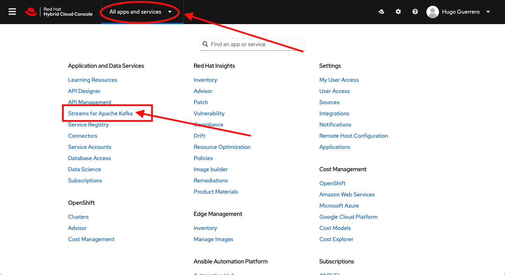
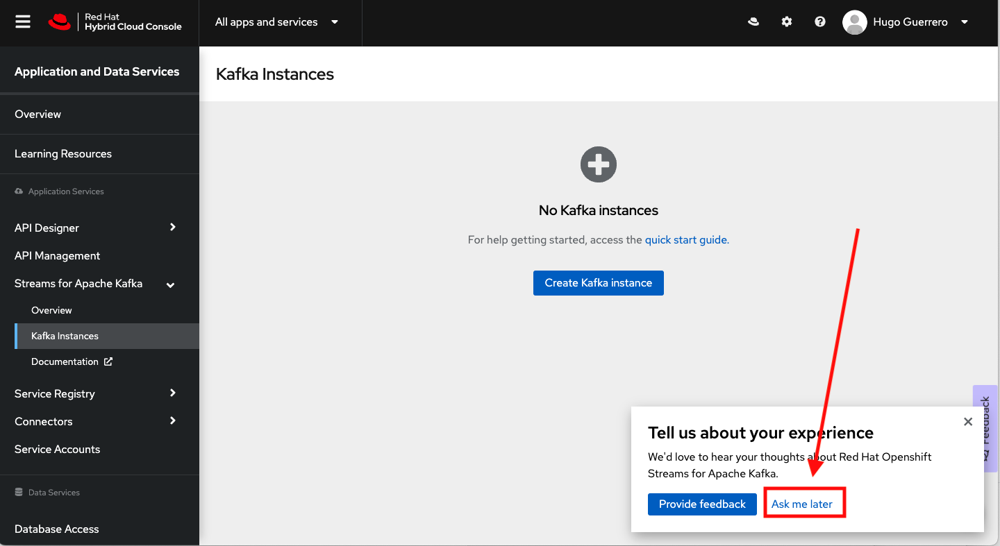
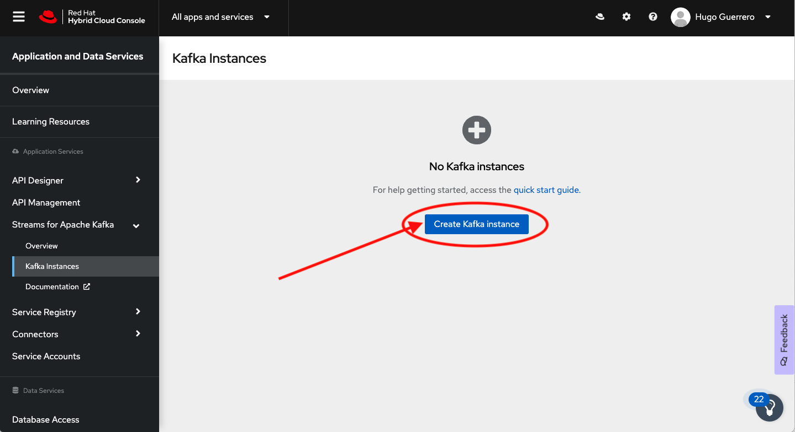
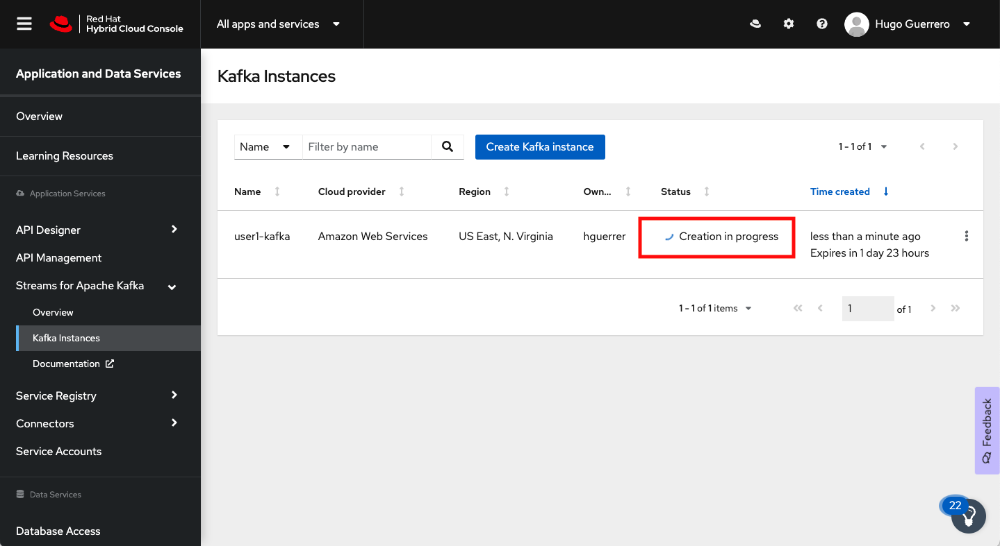
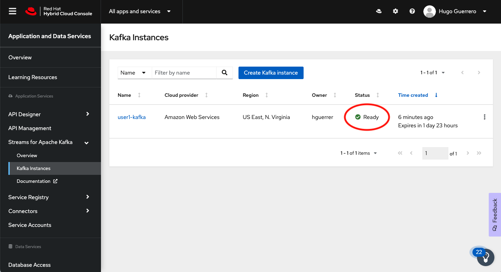
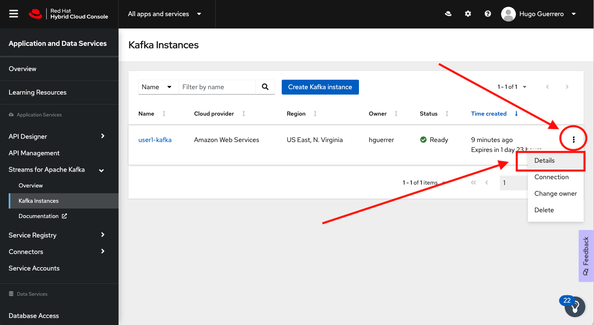
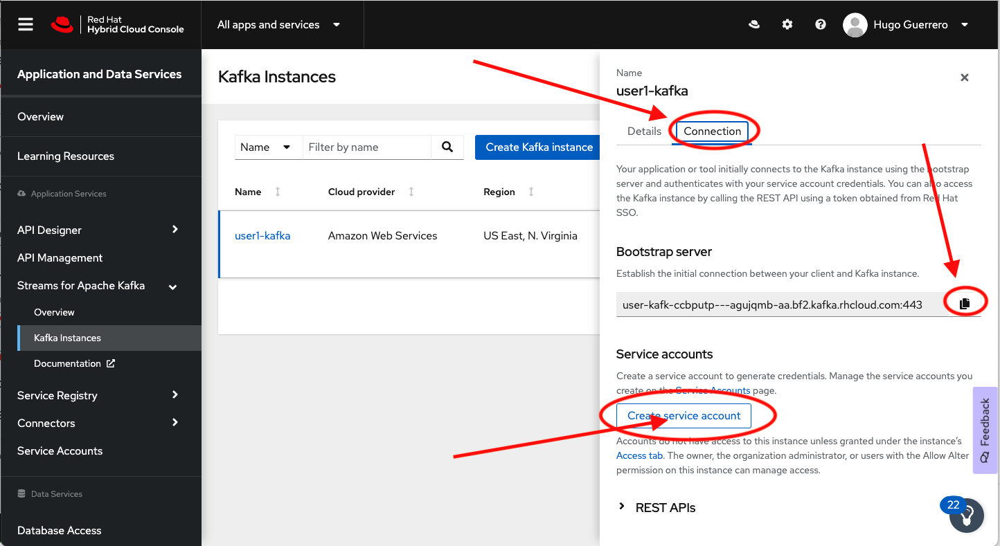
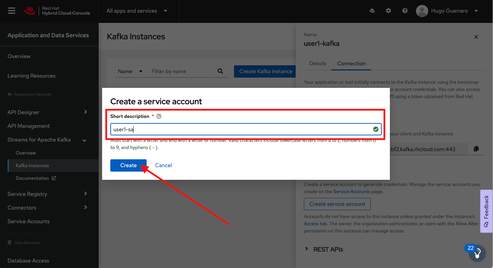
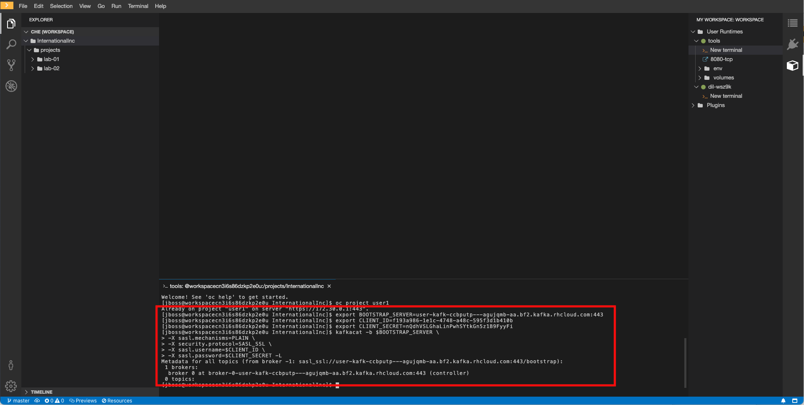

// Attributes
:walkthrough: Provision a Managed Kafka cluster
:title: Lab 1 - {walkthrough}
:user-password: openshift
:standard-fail-text: Verify that you followed all the steps. If you continue to have issues, contact a workshop assistant.
:namespace: {user-username}
:product-name: Streams for Apache Kafka
:codeready-url: http://codeready-codeready.{openshift-app-host}/
:cloud-console: https://console.redhat.com/

= {title}

This lab guides you through the process of obtaining a Kafka cluster that is managed by Red Hat using Red Hat OpenShift Streams for Apache Kafka.

*Overview*

This series of labs will guide you through the deployment of a hybrid-cloud architecture. A key element of this architecture is event streaming based upon Apache Kafka.

Managing Kafka is a specialized task. Red Hat OpenShift Streams for Apache Kafka provides Kafka clusters that are managed by Red Hat in the cloud vendor and region of your choice. This allows you to focus on business objectives, while Red Hat OpenShift {product-name} takes care of your infrastructure.

[type=walkthroughResource]
.Red Hat Hybrid Cloud
****
* link:{cloud-console}[Console, window="_blank"]
****

:sectnums:

[time=5]
== Accessing OpenShift {product-name}

. Log in to the Red Hat Hybrid Cloud Console at link:{cloud-console}[console.redhat.com, window="_blank"].
+
[NOTE]
====
If you do not have an existing account follow the *Register for a Red Hat account* link on the login page to create one. Otherwise use your Red Hat account to log into the system.
====
+

. Expand the *Find an app or service* dropdown at the top and select the *{product-name}* item.
+

. Dismiss the Welcome dialog by clicking on *Not now*.
+

{blank}

At this point you should be logged in and viewing the *OpenShift {product-name}* UI.

{blank}

image::images/00-kafka-streams-home.png[OpenShift {product-name} UI]

{blank}

Now that you have a cloud services account, you can start creating resources.

[time=5]
== Creating a Kafka Instance

. Click the *Create Kafka instance* button.
+

. Enter a name for your Kafka instance, e.g `{user-username}-kafka`.
. Use the default values for the available parameters.
. Click the *Create instance* button.
+

. This will start your cluster deployment. You should be able to see the status *Creation pending*.
+

{blank}

[NOTE]
====
Creation can take between 5 to 15 minutes. 
====

The *Status* column in the UI will display a
green checkmark and *Ready* status one the instance has finished provisioning.

{blank}

{blank}

It is time to create an account for application to connect to your new Kafka cluster.

[time=5]
== Instance Connection Details

Connecting to a {product-name} instance requires the *Bootstrap server URL* and
the *Client ID* and *Client Password* associated with a *Service Account*.

This section will show you how to obtain these values.

=== Obtain the Connection Details

. Click the kebab menu at the right side of the row of your Kafka instance and click *View details* to view the instance details panel.
+

. Select the *Connection* tab. Click the clipboard button to copy the *Bootstrap server* URL from this screen. Then click on *Create service account*.
+

. Enter `{user-username}-sa` in *Name* and `Workshop service account` in the *Description* for the Service Account. Click *Create*
+

. Copy the *Client ID* and *Client Secret* by clicking the clipboard button for each field to a secure location. After you are sure that you have the values secured, select the checkbox and click the *Close* button.
+
image::images/03-kafka-credentials.png[Kafka Service Account Details]
+
{blank}
+
[NOTE]
====
The service account *Client Secret* is only showed once in this dialog. If you didn't capture the value, you will need to regenerate the credentials for the service account.
====

You are now ready to test the connectivity to your cluster.

[time=5]
== Verify Connectivity

[type=taskResource]
.Red Hat CodeReady Workspaces
****
* link:{codeready-url}[Console, window="_blank", , id="resources-codeready-url"]
****
[type=taskResource]
.Credentials
****
* *username:* `{user-username}`
* *password:* `{user-password}`
****

Now that you have a cluster an account created is time to test the connectivity to your cluster. 

You'll use the link:https://github.com/edenhill/kafkacat[kcat, window="_blank"] command line utility to verify connectivity to your managed Kafka instance.

{blank}

. Navigate back to the link:{codeready-url}[CodeReady Workspace, window="_blank"] tab
. If you haven't done it, open the workspace named `dil-serverless-{user-username}`.
. If you don't have your terminal tab open:
.. Click on the _My Workspace_ (cube) icon on the right side panel.
.. Expand the **User Runtimes/tools** folder.
.. Click on *>_ New terminal*.
. Run the following command to connect to your Kafka instance and list topic metadata:
+
[NOTE]
====
Don't forget to replace the `<replace-me>` part of the command with the values you previously wrote down.
====
.. Export the Bootstrap server:
+
[source,bash,subs="attributes+"]
----
export BOOTSTRAP_SERVER=<replace-me>
----
.. Export the Client Id:
+
[source,bash,subs="attributes+"]
----
export CLIENT_ID=<replace-me>
----
.. Export the Client Id:
+
[source,bash,subs="attributes+"]
----
export CLIENT_SECRET=<replace-me>
----
.. Finally run the kcat command:
+
[source,bash,subs="attributes+"]
----
kafkacat -b $BOOTSTRAP_SERVER \
-X sasl.mechanisms=PLAIN \
-X security.protocol=SASL_SSL \
-X sasl.username=$CLIENT_ID \
-X sasl.password=$CLIENT_SECRET -L
----
. The command will print a list of brokers and topic metadata if you've passed valid parameters.
+

{blank}

Congratulations! You successfully created a new Kafka cluster to send and receive events. You're now ready to move onto the next lab!
