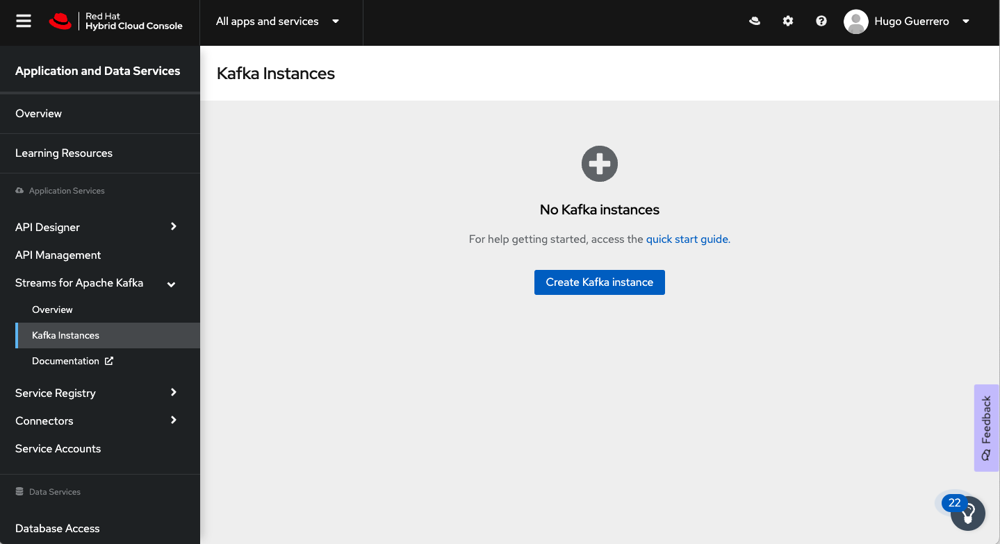

// Attributes
:walkthrough: Provision a Managed Kafka cluster
:title: Lab 1 - {walkthrough}
:standard-fail-text: Verify that you followed all the steps. If you continue to have issues, contact a workshop assistant.
:namespace: {user-username}
:product-name: Streams for Apache Kafka
:codeready-url: http://codeready-codeready.{openshift-app-host}/
:cloud-console: https://console.redhat.com/

= {title}

This lab guides you through the process of obtaining a Kafka cluster that is managed by Red Hat using Red Hat OpenShift Streams for Apache Kafka.

*Overview*

This series of labs will guide you through the deployment of a hybrid-cloud architecture. A key element of this architecture is event streaming based upon Apache Kafka.

Managing Kafka is a specialized task. Red Hat OpenShift Streams for Apache Kafka provides Kafka clusters that are managed by Red Hat in the cloud vendor and region of your choice. This allows you to focus on business objectives, while Red Hat OpenShift {product-name} takes care of your infrastructure.

[time=5]
== Accessing OpenShift {product-name}

. Log in to the Red Hat Hybrid Cloud Console at link:{cloud-console}[console.redhat.com, window="_blank"].
+
[NOTE]
====
If you do not have an existing account follow the *Register for a Red Hat account* link on the login page to create one.
====
. Expand the *Find an app or service* dropdown at the top.
. Select the *{product-name}* item.

{blank}

At this point you should be logged in and viewing the *OpenShift {product-name}* UI.

{blank}

{blank}

[time=5]
== Creating a Kafka Instance

. Click the *Create Kafka instance* button.
. Enter a name for your Kafka instance, e.g `{user-username}-kafka`.
. Use the default values for the available parameters.
. Click the *Create instance* button.

{blank}

Creation can take up to 5 minutes. The *Status* column in the UI will display a
green checkmark and *Ready* status one the instance has finished provisioning.

{blank}

image::images/01-kafka-ready.png[Kafka instance in Ready state]

{blank}

[time=5]
== Connecting to a Kafka Instance

Connecting to a {product-name} instance requires the *Bootstrap server URL* and
the *Client ID* and *Client Password* associated with a *Service Account*.

This section will show you how to obtain these values.

=== Obtain the Connection Details

. Click the row for your Kafka instance to view the instance details panel.
. Select the *Connection* tab. The *Bootstrap server* URL can be obtained from this screen.
+
image::images/02-kafka-details.png[Kafka instance in Ready state]
. Click the *Create service account* button.
. Enter a *Name* and *Description* for the Service Account. Click *Create*
. Copy the *Client ID* and *Client Secret* to a secure location.
+

=== Verify Connectivity

You'll use the link:https://github.com/edenhill/kafkacat[kafkacat CLI, window="_blank"]
to verify connectivity to your managed Kafka instance.

{blank}

. Navigate to the link:{codeready-url}[CodeReady Workspace, window="_blank"]
. Open the workspace named `dil-serverless-{user-username}`.
. Click on the _My Workspace_ (cube) icon on the right side panel.
. Expand the **User Runtimes/tools** folder.
. Click on *>_ New terminal*.
. Run the following command to connect to your Kafka instance and list topic metadata:
+
[source,bash,subs="attributes+"]
----
# You obtained these from the {product-name} UI previously
export BOOTSTRAP_SERVER=<replace-me>
export CLIENT_ID=<replace-me>
export CLIENT_SECRET=<replace-me>

kafkacat -b $BOOTSTRAP_SERVER \
-X sasl.mechanisms=PLAIN \
-X security.protocol=SASL_SSL \
-X sasl.username=$CLIENT_ID \
-X sasl.password=$CLIENT_SECRET -L
----
. The command will print a list of brokers and topic metadata if you've passed valid parameters.

// TODO: replace with screenshot from codeready workspaces
image::images/04-kafkacat-metadata.png[Kafkacat Metdata Listing]

{blank}

You're now ready to move onto the next lab!
