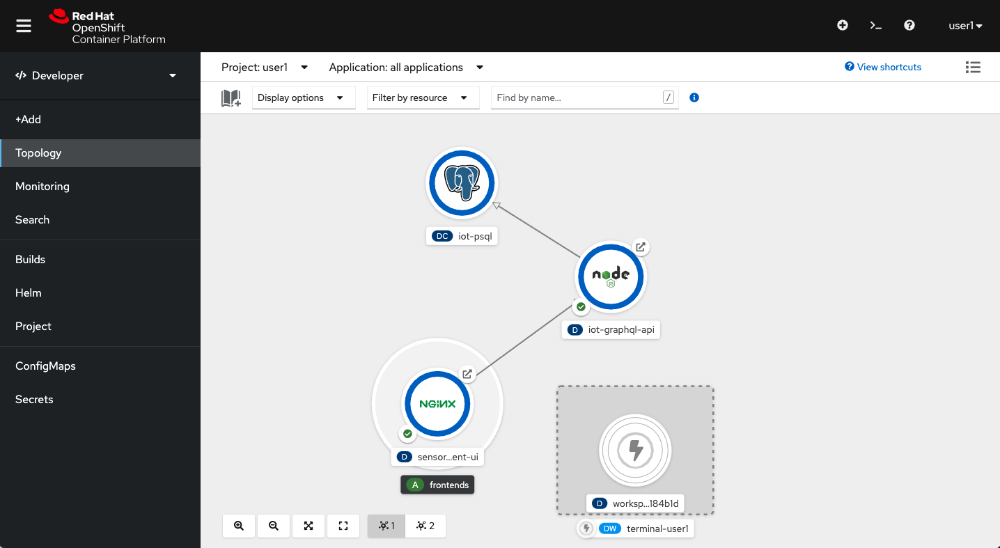
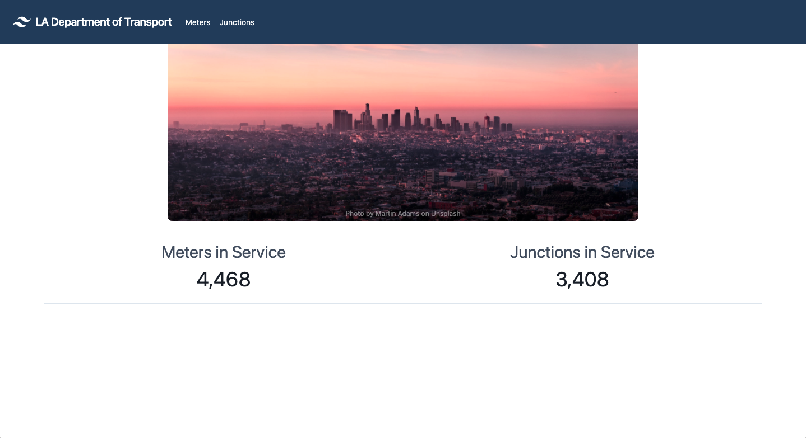
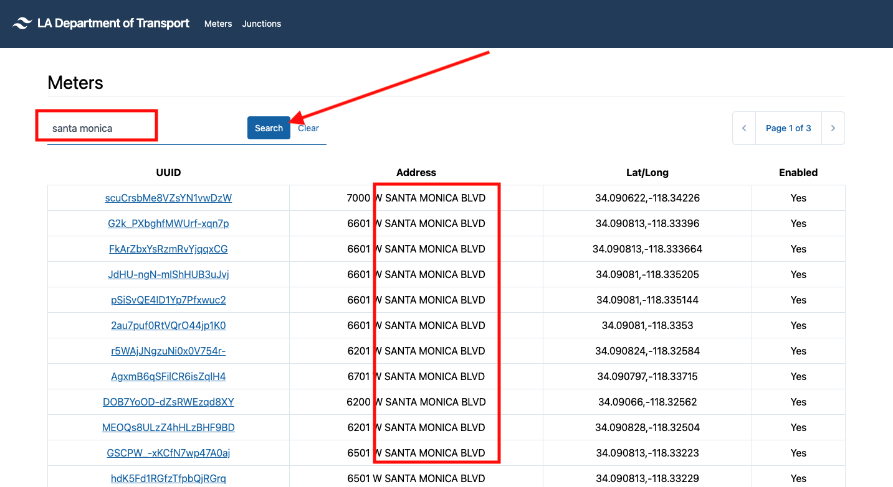
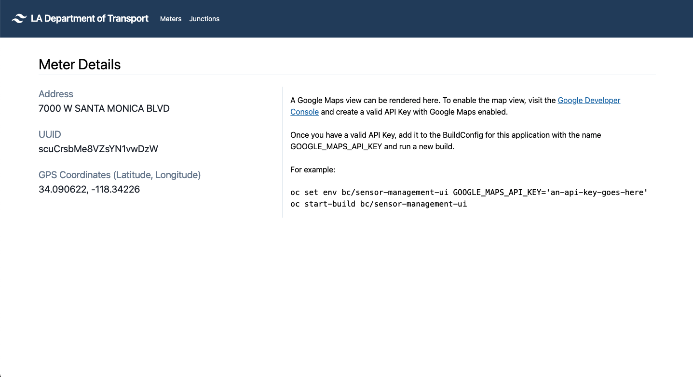
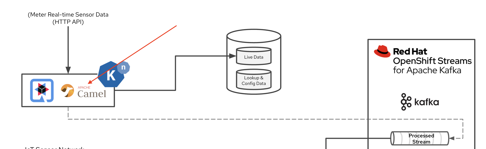
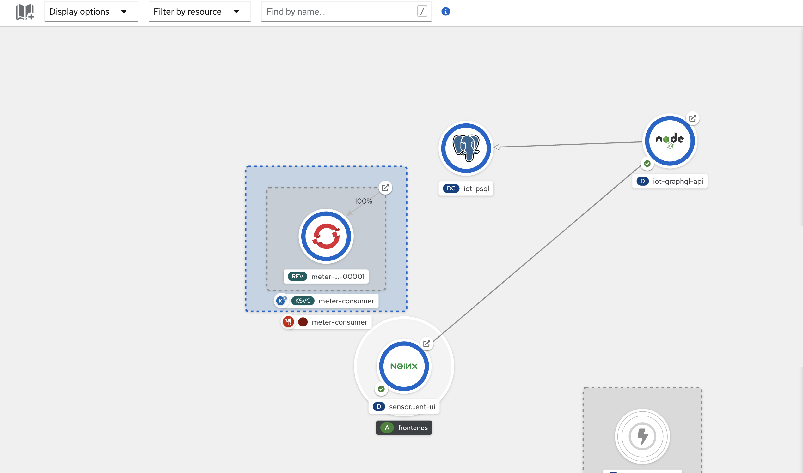
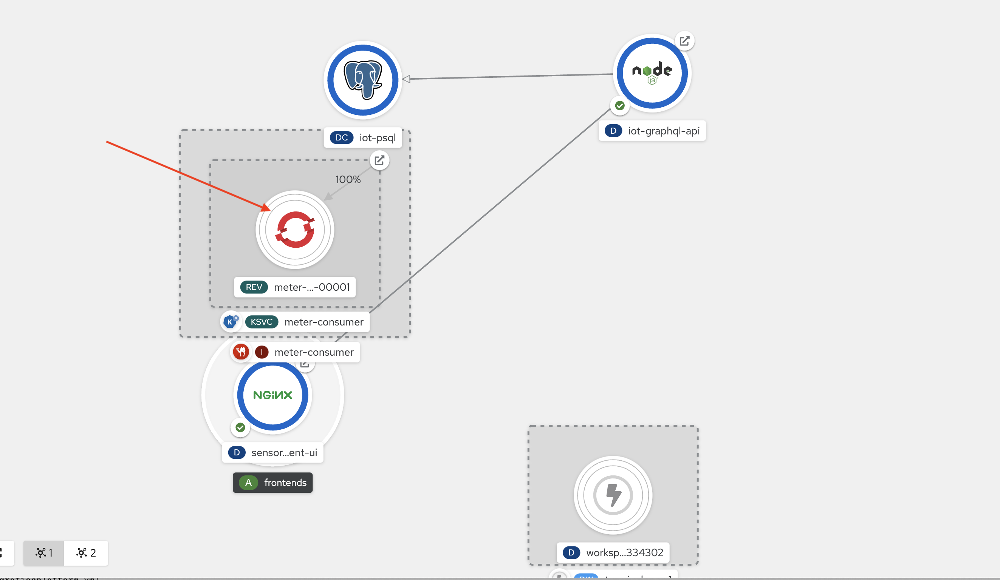

// Attributes
:walkthrough: Serverless Integration with Camel K
:title: Lab 2 - {walkthrough}
:user-password: openshift
:standard-fail-text: Verify that you followed all the steps. If you continue to have issues, contact a workshop assistant.
:namespace: {user-username}
:rhosak: Red Hat OpenShift Streams for Apache Kafka
:rhoas: Red Hat OpenShift Application Services
:product-name: {rhosak}
:meter-topic: hydrated-meter-events
:cloud-console: https://console.redhat.com

// URLs
:openshift-streams-url: https://console.redhat.com/beta/application-services/streams/kafkas
:next-lab-url: https://tutorial-web-app-instructions.{openshift-app-host}/tutorial/dayinthelife-serverless.git-labs-03-kafka-mirrormaker-camelk/
:codeready-url: http://codeready-codeready.{openshift-app-host}/

[id='knative-serving-camel-k']
= {title}

In this lab, you will be part of the team at International Inc that will be helping your local town to enable "smart city" capabilities using serverless technologies.

*Overview*

Your town is starting its journey to become a *smart city*. Recently, the county updated Parking Meters in its most popular zones with IoT capabilities. These "smart" parking meters can be programmed to ping a REST API endpoint when they change status, e.g from _AVAILABLE_ to _OCCUPIED_.

Data generated by the smart Parking Meters needs to be made available to city engineers in real-time via web/mobile applications, but it also needs to be persisted and joined with reference data from a an existing RDBMS.

In this lab you'll create and deploy a REST API that will ingest Parking Meter updates. The REST API will write these updates to the existing PostgreSQL database, and your Managed Kafka cluster from {rhosak}.

Your REST API will be built using Quarkus and Camel  K, and served using
Knative. Knative will allow this API to scale up/down based on load.

A quick reminder before you get started. Use the following credentials to login into the OpenShift and OpenShift Dev Spaces consoles:

* Your *username* is: `{user-username}`
* Your *password* is: `{user-password}`

[type=walkthroughResource,serviceName=codeready]
.Red Hat OpenShift Dev Spaces
****
* link:{codeready-url}[Console, window="_blank", , id="resources-codeready-url"]
****
[type=walkthroughResource]
.Red Hat OpenShift Developer Console
****
* link:{openshift-host}/topology/ns/{namespace}[Topology View, window="_blank"]
****
[type=walkthroughResource]
.Red Hat OpenShift Application Services
****
* link:{openshift-streams-url}[Streams for Apache Kafka, window="_blank"]
****

:sectnums:

[time=5]
== View the Project Topology and UI

Some services for this lab were provisioned ahead of time to provide a streamlined lab experience. View the services by following these instructions:

. Login to the link:{openshift-host}/topology/ns/{namespace}/graph[OpenShift Console, window="_blank"] to view the *{namespace}* project.
. The Topology view should look similar to this screenshot.
+

. The services displayed are as follows:
    * A Postgres database containing reference data for Parking Meters. This database has the Debezium CDC extensions pre-configured to simplify this workshop.
    * A GraphQL API built using Node.js and link:https://graphback.dev[Graphback, window="_blank"]. This provides access to Meter and Junction data stored in Postgres.
    * An NGINX container that serves a web application built using React. This web application communicates with the GraphQL API.
. Click on the NGINX node in the Topology View and select the the *Resources* tab.
+

. Scroll all the way down and click the URL listed under *Routes*. It should look similar to the following: `https://sensor-management-ui-{namespace}.{openshift-app-host}`.
+

. The link should render a web application with a title *LA Department of Transport* similar to the one shown below.
+

. Click the *Meters* link in the navigation bar at the top of the application. A list of meters should be displayed.
+

+
{blank}
+
[NOTE]
====
The previous step verifies that the Node.js GraphQL API is communicating with the Postgres database.
====
. Enter `santa monica` into the search field and press Enter or click the blue *Search* button. Parking Meters from _Santa Monica Blvd_ are listed.
+

. Select the first item on the list. A details screen for that Parking Meter should be displayed.
+

{blank}

[type=verification]
Were you able to view the Meters list in the web application? If so, you are ready to start working on the next set of tasks.

[type=verificationFail]
{standard-fail-text}

[time=10]
== Prepare the Kafka Integration

=== Create a Kafka Topic

Before building the REST API, you'll need to create a Topic using the {rhosak} UI.

. Open the link:{openshift-streams-url}[OpenShift Streams Console, window="_blank"].
. Click name of the Kafka cluster you created in the previous lab,e.g `{user-username}-kafka`. This will display a cluster Dashboard.
. Select the *Topics* tab from the UI.
+

. Click the *Create Topic* button
.. Enter `{meter-topic}` for the topic name, and click *Next*.
.. Set the number of partitions to 3, and click *Next*.
.. Leave the message retention settings at the default values, and click *Next*.
.. The in-sync replicas is hardcoded to 2 of 3.
. Click *Finish* to create the Topic.

=== Connect your Kafka Cluster and OpenShift Project

Your OpenShift environment has been pre-configured with the {rhoas} Operator. This Operator, along with the {rhoas} CLI simplifies the management of managed service credentials and access.

Embed your Managed Kafka connection details OpenShift Project:

. Obtain a token from link:{cloud-console}/openshift/token[console.redhat.com/openshift/token, window="_blank"] using the *Load Token* button. The Operator will use this to communicate the {rhoas} APIs.
+

. Navigate to your workspace in link:{codeready-url}[OpenShift Dev Spaces, window="_blank"].
. Click on the _My Workspace_ (cube) icon on the right side panel.
. Expand the *User Runtimes/tools* section.
. Click on *>_ New terminal*.
. First, login into OpenShift using the OpenShift CLI:
+
[source,bash,subs="attributes+"]
----
oc login -u {user-username} -p {user-password} https://$KUBERNETES_SERVICE_HOST:$KUBERNETES_SERVICE_PORT --insecure-skip-tls-verify=true
----

. Next, login using {rhoas} CLI:
+
[source,bash,subs="attributes+"]
----
export TOKEN=<YOUR_TOKEN_GOES_HERE>
----
+
{blank}
+
[source,bash,subs="attributes+"]
----
rhoas login --token $TOKEN
----
+
{blank}
+
[NOTE]
====
Select `Y` for the anonymous data. Select `N` when prompted to update the CLI.
====
+
{blank}
+
You will see a success message similar to this:
+
----
✔️  You are now logged in as "your_username"
----

. Set your Managed Kafka as the working context. This command will provide a prompt to choose your Kafka cluster:
+
[source,bash,subs="attributes+"]
----
rhoas kafka use
----
. Connect your Managed Kafka and OpenShift Project:
+
[source,bash,subs="attributes+"]
----
rhoas cluster connect --token $TOKEN --namespace {namespace}
----
+
{blank}
+
You will be prompted to select a service. Choose `kafka`, then confirm de details of the connection.
+
{blank}
+
You should see a result similar to the following:
+
----
✔️  kafka resource "user1-kafka" has been created
Waiting for status from kafka resource.
Created kafka can be already injected to your application.

To bind you need to have Service Binding Operator installed:
https://github.com/redhat-developer/service-binding-operator

You can bind kafka to your application by executing "rhoas cluster bind"
or directly in the OpenShift Console topology view.

✔️  Connection to service successful.
----

At this point your OpenShift Project will have the required details for applications to connect to your Managed Kafka. These details include:

* A *KafkaConnection* Custom Resource (CR)
* A *rh-cloud-services-service-account* Secret. This contains a SASL Client ID and Client Secret.
* A *rh-cloud-services-accesstoken* Secret. This contains the {rhoas} API Token.

Verify these resources exist using the following commands:

. List the Secrets and verify the list contains *rh-cloud-services-service-account* and *rh-cloud-services-accesstoken*:
+
[source,bash,subs="attributes+"]
----
oc get secrets -n {namespace}
----
. Describe the *KafkaConnection*, and verify that the output contains references to the Secrets and Bootstrap Server:
+
[source,bash,subs="attributes+"]
----
oc describe kafkaconnection -n {namespace}
----

Your now ready to deploy applications that connect to your Managed Kafka cluster.

[time=15]
[id="Serving with API"]
== Knative Serving, Camel K, & REST API

Now you're familiar with the OpenShift Topology and existing services, and have a Kafka Topic ready to ingest data. It's time to build and deploy your REST API.

You build the API using Camel K and Quarkus.

+

=== Define and Build the API

. Navigate to your workspace in link:{codeready-url}[OpenShift Dev Spaces, window="_blank"].
. Expand the *projects/lab-01* folder.
. Open the *openapi-spec.yaml* file.

This file defines the API you'll deploy. Notice that the API:

* Exposes a `POST /meter/status` endpoint.
* The POST request `content-type` must be `application/json`.
* A *meterstatus* schema is defined as the format for the POST body.
* The response type on success is defined as `200 OK`.

Camel K will use expose this OpenAPI Spec for consumers to build compliant API clients.

To build the REST API:

. Navigate to your workspace in link:{codeready-url}[OpenShift Dev Spaces, window="_blank"].
. Expand the *projects/lab-01* folder.
. Open the *MeterConsumer.java* file.

The *MeterConsumer.java* file defines a link:https://camel.apache.org/manual/latest/java-dsl.html[Camel Route using the Java DSL, window="_blank"].

The first line of this file contains a `camel-k` directive. This directive defines options that are used by Camel K when it builds and deploys the Camel Route. For example, it references the *openapi-spec.yaml* file to define the REST API endpoint, and the *rh-cloud-services-service-account* Secret to connect to your Managed Kafka cluster.

. Open the *meters.properties* file and replace the *camel.component.kafka.brokers* value with your Managed Kafka bootstrap server URL. 

. The Kafka bootstrap server URL can be obtained via the UI, or CLI command:
+
[source,bash,role="copypaste",subs="attributes+"]
----
rhoas kafka describe
----

. Build and deploy the REST API as a serverless function:
+
[source,bash,role="copypaste",subs="attributes+"]
----
cd projects/lab-01/
----
+
[source,bash,role="copypaste",subs="attributes+"]
----
kamel run MeterConsumer.java --namespace {namespace}
----
. Give it a couple of minutes. In developer view console, A new Camel serverless application will apear.
+

. Wait for another minute, the serverless application will scale down to zero. In developer view console, the blue circle will disaapear and eventually disappear. 
+

=== Test the REST API
. Return to the link:{openshift-host}/topology/ns/{namespace}/graph[OpenShift Topology View, window="_blank"] and wait for the *meter-consumer* Pod to start.
+

. Click the Camel K Pod and copy the URL listed under *Routes*.
. In the OpenShift Dev Spaces terminal, send a HTTP POST request to make sure everything works correctly:
+
[source,bash,role="copypaste",subs="attributes+"]
----
export TIMESTAMP=`date +%s`

curl -X POST \
http://meter-consumer-{namespace}.{openshift-app-host}/meter/status \
-H 'content-type: application/json' \
-d '
     {
        "key": "F6PeB2XQRYG-8EN5yFcrP",
        "value": {"meterId":"F6PeB2XQRYG-8EN5yFcrP","timestamp":'$TIMESTAMP',"status":"unknown"}
      }
'
----

. Fetch the inserted result, from the database:
+
[source,bash,role="copypaste"]
----
oc exec $(oc get pods -o custom-columns=POD:.metadata.name --no-headers -l app=iot-psql) -- bash -c 'psql -d $POSTGRES_DB -U $POSTGRES_USER -c "select * from meter_update;"'
----
+

. Return to the link:{openshift-host}/topology/ns/{namespace}/graph[OpenShift Topology View, window="_blank"] and wait for the *meter-consumer* Pod to scale down to zero. You'll know this happened when the blue circle turns white.

. In the OpenShift Dev Spaces terminal, send another HTTP POST request, and see the Pod scales back up to handle it:
+
[source,bash,role="copypaste",subs="attributes+"]
----
export TIMESTAMP=`date +%s`

curl -X POST \
http://meter-consumer-{namespace}.{openshift-app-host}/meter/status \
-H 'content-type: application/json' \
-d '
     {
        "key": "F6PeB2XQRYG-8EN5yFcrP",
        "value": {"meterId":"F6PeB2XQRYG-8EN5yFcrP","timestamp":'$TIMESTAMP',"status":"unknown"}
      }
'
----

[type=verification]
Did it scale up and down?

[type=verificationFail]
{standard-fail-text}

[time=1]
[id="summary"]
== Summary

In this lab you successfully create and deploy a REST API that will ingest Parking Meter updates with simple Camel serverless integrations.
You can now proceed to link:{next-lab-url}[Lab 3].
