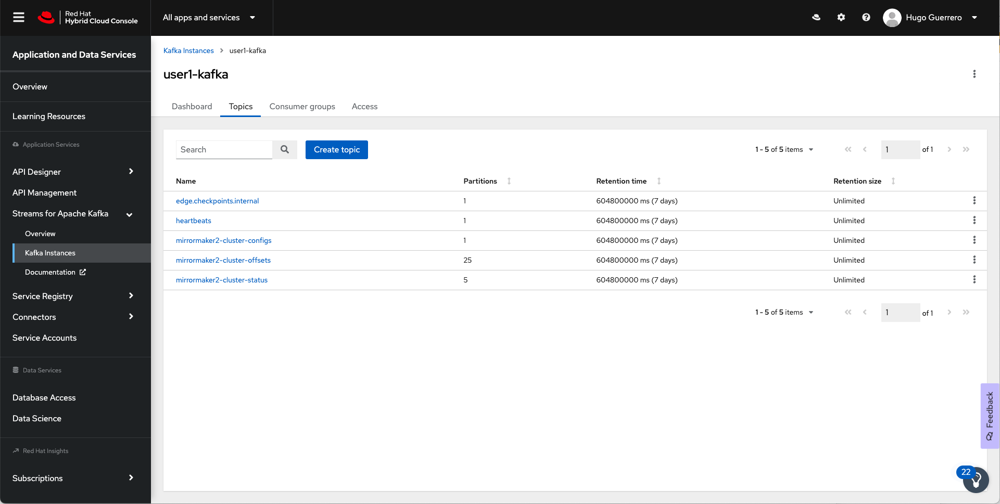

// Attributes
:walkthrough: Data replication with Kafka and MirrorMaker2
:title: Lab 3 - {walkthrough}
:user-password: openshift
:standard-fail-text: Verify that you followed all the steps. If you continue to have issues, contact a workshop assistant.
:smartcity-edge-namespace: {user-username}-smartcity-edge
:smartcity-central-namespace: {user-username}-smartcity-central
:rhosak: Red Hat OpenShift Streams for Apache Kafka
:rhoas: Red Hat OpenShift Application Services
:cloud-console: https://console.redhat.com
:codeready-project: InternationalInc

// URLs
:openshift-streams-url: https://console.redhat.com/beta/application-services/streams/kafkas
:next-lab-url: https://tutorial-web-app-webapp.{openshift-app-host}/tutorial/dayinthelife-streaming.git-labs-02-/
:codeready-url: http://codeready-codeready.{openshift-app-host}/
:openshift-console: http://console-openshift-console.{openshift-app-host}/

[id='kafka-mirrormaker-camel-k']
= {title}

In this lab you will use AMQ Streams to move data across two Apache Kafka clusters geographically separated from each other using Mirror Maker 2.

*Overview*

The city of <insert your favorite city here> is introducing a low emission zone in the city center in an effort to discourage polluting vehicles from travelling in the downtown areas. A number of automated toll stations are being built at the major approach routes to the city center. These toll stations are equipped with cameras and license plate recognition software to register the entering vehicles. Every vehicle passing the toll station generates an event with the license plate. A central datahub collects all the events generated by the different toll stations for further processing, such as billing the vehicle owners and data analysis.

In this lab you will set up (part of) the central datahub. Each toll station (which represents the edge of the network) stores its events in a local Kafka cluster. In the central datahub all events from the edge locations are streamed to a central Kafka cluster, using Kafka Mirrormaker. The central Kafka cluster is a managed {rhosak} cluster. To illustrate how these aggregated events can be consumed, you will deploy a Camel K application which stores the events in a relational database. 

<TODO: image of overall architecture>

:sectnums:

== Edge walkthrough

The *{smartcity-edge-namespace}* project represents a toll station edge deployment. It has been provisioned ahead of time. You can view the services by following these instructions:

. Login to the link:{openshift-console}/topology/ns/{smartcity-edge-namespace}/graph[OpenShift Console, window="_blank"] to view the *{smartcity-edge-namespace}* project.
. The Topology view should look similar to this screenshot.
+

. The services displayed are as follows:
    * An AMQ Streams Kafka cluster.
    * The *lpr-service* application. This Python application encapsulates the AI/ML model used to detect and recognize license plates on the pictures of the cars passing through the station. The application exposes a REST interface which takes the picture of the vehicle, and returns a JSON payload with the result of the license plate recognition.
    * The *image-generator* application. This application simulates the generation of vehicle images. For this lab we use a collection of car pictures uploaded to a S3 bucket. The image generator randomly selects one of these pictures at a regular interval and posts a message containing the link to the image to the `images` topic on the local Kafka cluster.
    * The *image-processor* application. This application consumes the messages from the `images` topic, gets the image from the S3 bucket, invokes the Python AI/ML application and finally posts a message with the result of the license plate recognition to the `toll-station-events` topic in the the local Kafka cluster.
. Note that the *image-generator* application is scaled down to zero pods. Towards the end of the lab you will scale it up to 1 pod to create a message flow from the edge to the central datahub.

== Central Datahub walkthrough

The *{smartcity-central-namespace}* project represents the smart city central datahub. For this lab it is running on the same OpenShift cluster as the edge, while in reality it would be running on a different cluster, probably on a different cloud.

. Login to the link:{openshift-console}/topology/ns/{smartcity-central-namespace}/graph[OpenShift Console, window="_blank"] to view the *{smartcity-central-namespace}* project.
. The Topology view should look similar to this screenshot.
+

. At this moment, the project only contains the PostgreSQL database where the toll station events will be stored. The other components (Kafka MirrorMaker, Camel K integration) will be added in the remainder of this lab.

[time=10]
== Install Kafka MirrorMaker

Kafka MirrorMaker 2, part of the Apache Kafka ecosystem, is a tool to replicate or mirror Kafka topics between clusters. It can be used to provide high availability and disaster recovery for Kafka clusters, but also to aggregate data from several disparate Kafka clusters into a central cluster.

In this lab you will use Kafka MirrorMaker to aggregate the data in the edge Kafka clusters into a central Kafka cluster. As central Kafka cluster you use the managed Kafka instance you created in the previous lab.

Kafka MirrorMaker 2 can be installed using the AMQ Streams operator, which has been installed on your OpenShift cluster.

=== Connect your managed Kafka Cluster and OpenShift Project

In the previous lab you used the `rhoas` CLI to connect your managed Kafka cluster. For this lab some of these steps need to be repeated because you are working in another namespace of the OpenShift cluster.

. If you finished the previous lab, you should be logged in to link:https://console.redhat.com[console.redhat.com]. You can verify this with the `rhoas --whoami` command.
+
[source,bash,subs="attributes+"]
----
rhoas --whoami
----
+
If the output of the command says that you are not logged in, refer to the instructions in the previous lab to log in.

. Connect your Managed Kafka and OpenShift Project:
+
[source,bash,subs="attributes+"]
----
rhoas cluster connect --token $TOKEN --namespace {smartcity-central-namespace}
----
+
At this point your OpenShift Project will have the required details for applications to connect to your Managed Kafka. These details include:

* A *KafkaConnection* Custom Resource (CR)
* A *rh-cloud-services-service-account* Secret. This contains a SASL Client ID and Client Secret.
* A *rh-cloud-services-accesstoken-cli* Secret. This contains the {rhoas} API Token.

[type=verification]
Were you able to successfully connect to the managed Kafka cluster?

[type=verificationFail]
{standard-fail-text}

=== Install Kafka MirrorMaker

. Navigate to your workspace in link:{codeready-url}[CodeReady Workspaces, window="_blank"].
. Expand the *projects/lab-2* folder.
. Open the *kafka-mirrormaker* file. +
  The *kafka-mirrormaker* defines the Kafka MirrorMaker Custom Resource. Note the following details:
  ** Lines 28 to 46 define the different Kafka clusters for which replication will be set up: the edge cluster and the central cluster.
  ** In this lab, the edge Kafka cluster is in the the same OpenShift cluster, so you can connect to it through the internal bootstrap URL.
  ** The connection to the managed central Kafka cluster requires the bootstrap address and the credentials. You will add these in the next step.
  ** Lines 46 to 65 define the different replications. In this case we have only one, using the edge Kafka cluster as source and the central cluster as destination.
  ** The `topicPatterns` property defines the topics that need to be replicated between the source and destination clusters. In this case we only want to replicate the `toll-station-events` topic.
  ** The data from the source cluster topic will be replicated to a topic named `edge-toll-station-events` on the destination cluster. The `edge-` prefix is the concatenation of the alias of the source cluster (`edge`) and the value of the `replication.policy.separator` property.
. Replace the placeholders in the file (everything surrounded with `{{ }}`) with the appropriate values:
** `{{user}}`: replace with your OpenShift user name, {user-username}.
** `{{smartcity-central-bootstrap-server}}`: replace with the bootstrap address of the managed server. The bootstrap address can be obtained from the *KafkaConnection* CR:
+
[source,bash,subs="attributes+"]
----
oc get KafkaConnection $(oc get KafkaConnection --no-headers -o custom-columns=NAME:.metadata.name -n {smartcity-central-namespace}) -n {smartcity-central-namespace} --template='{{.status.bootstrapServerHost}}'; echo
----
** `{{smartcity-central-service-account-id}}`: replace with the id of the service account created by the `rhoas connect` command. You can obtain the value with the following command:
+
[source,bash,subs="attributes+"]
----
oc get secret rh-cloud-services-service-account -n {smartcity-central-namespace} --template='{{index .data "client-id"}}' | base64 -d; echo
----
** Use the following command to replace all placeholders from the command line:
+
[source,bash,subs="attributes+"]
----
  sed -i "s/{{smartcity-central-bootstrap-server}}/$(oc get KafkaConnection $(oc get KafkaConnection --no-headers -o custom-columns=NAME:.metadata.name -n {smartcity-central-namespace}) -n {smartcity-central-namespace} --template='{{.status.bootstrapServerHost}}')/g" /projects/{codeready-project}/projects/lab-02/kafka-mirrormaker.yml && \
  sed -i "s/{{smartcity-central-service-account-id}}/$(oc get secret rh-cloud-services-service-account -n {smartcity-central-namespace} --template='{{index .data "client-id"}}' | base64 -d)/g" /projects/{codeready-project}/projects/lab-02/kafka-mirrormaker.yml && \
  sed -i "s/{{user}}/{user-username}/g" /projects/{codeready-project}/projects/lab-02/kafka-mirrormaker.yml
----
. Deploy the Kafka MirrorMaker Custom Resource:
+
[source,bash,subs="attributes+"]
----
oc create -f /projects/{codeready-project}/projects/lab-02/kafka-mirrormaker.yml -n {smartcity-central-namespace}
----
. Follow the deployment of the Kafka MirrorMaker instance in the link:{openshift-host}/topology/ns/{smartcity-central-namespace}[Topology View, window="_blank"] of the {smartcity-central-namespace} project. After a couple of seconds you should see that the MirrorMaker pod deployed successfully:
+

. Kafka MirrorMaker created a number of topics in the managed Kafka cluster. You can verify this in the *Topics* pane of your Kafka cluster in the link:{openshift-streams-url}[OpenShift Streams Console, window="_blank"].
+

+
Notice the *edge-toll-station-events* topic, which is the replica of the *toll-station-events* topic on the edge Kafka cluster.

[type=verification]
Were you able to install Kafka MirrorMaker successfully?

[type=verificationFail]
{standard-fail-text}

[time=10]
== Integration with Camel K

The next step is consuming the replicated data from the managed Kafka cluster for further processing. In this lab, you are going to use a Camel K integration to consume the messages from the managed Kafka cluster and store them in a PostgreSQL database.

=== Deploy the Camel K Integration

. Navigate to your workspace in link:{codeready-url}[CodeReady Workspaces, window="_blank"].
. Expand the *projects/lab-02* folder.
. Open the *TollStationEventConsumer.java* file. +
The *TollStationEventConsumer.java* file defines a Camel route using the Java Camel DSL. The route consumes from the Kafka topic defined by the property `consumer.topic`, and inserts the content of the message in the PostgresSQL database. +
The first line of the file contains a _camel-k directive_. This directive defines options that are used by Camel K when it builds and deploys the Camel Route. For example, it points to the *tollstationeventconsumer.properties* file as application properties, and the *rh-cloud-services-service-account* Secret to connect to the managed Kafka cluster.
The Camel route will be deployed on top of a Quarkus runtime, hence we can use the datasource functionalities provided by Quarkus.
. Open the *tollstationeventconsumer.properties* file. +
This file defines the properties for the Camel Route. +
In the file replace the `{{smartcity-central-bootstrap-server}}` with the bootstrap address of the managed Kafka cluster:
+
[source,bash,subs="attributes+"]
----
sed -i "s/{{smartcity-central-bootstrap-server}}/$(oc get KafkaConnection $(oc get KafkaConnection --no-headers -o custom-columns=NAME:.metadata.name -n {smartcity-central-namespace}) -n {smartcity-central-namespace} --template='{{.status.bootstrapServerHost}}')/g" /projects/{codeready-project}/projects/lab-02/tollstationeventconsumer.properties
----
+
Note that we use a Regex pattern to specify the topics to consume from: `^*.-toll-station-events`. This ensures that the route will consume from all the topics ending with `toll-station-events`. So if you add another edge deployment to the solution, its events will be consumed by the Camel Route, without the need to change the route itself.

. Build and deploy the Camel K integration:
+
[source,bash,subs="attributes+"]
----
cd /projects/{codeready-project}/projects/lab-02
----
+
[source,bash,subs="attributes+"]
----
kamel run TollStationEventConsumer.java --namespace {smartcity-central-namespace}
----

. As a result of the `kamel run` command, an image with the Camel Route is built and deployed on the OpenShift cluster. You can check the build progress by navigating to the link:https://console-openshift-console.{openshift-app-host}/k8s/ns/{smartcity-central-namespace}/builds[Builds view on the OpenShift Console]

. Navigate to the link:https://console-openshift-console.{openshift-app-host}/topology/ns/{smartcity-central-namespace}/graph[OpenShift Topology View], and wait for the *toll-station-event-consumer* pod to start.
+

[type=verification]
Were you able to run the TollStationEventConsumer Camel K application successfully?

[type=verificationFail]
{standard-fail-text}

== Test the solution

At this point, all the components of the solution are in place. You can now test by generating images on the edge, which produces toll station events on the edge Kafka cluster. These messages are replicated to the central managed Kafka cluster, and consumed by the Camel K integration, which inserts the payload in the PostgreSQL database.

. Scale up the *generator* deployment in the {smartcity-edge-namespace} namespace to 1 pod.
+
[source,bash,subs="attributes+"]
----
oc scale deployment/image-generator -n {smartcity-edge-namespace} --replicas=1
----

. Check the logs of the *toll-station-event-consumer* pod.
+
[source,bash,subs="attributes+"]
----
oc logs -f $(oc get pod -o custom-columns=POD:.metadata.name --no-headers -l camel.apache.org/integration=toll-station-event-consumer -n {smartcity-central-namespace}) -n {smartcity-central-namespace}
----
+
After a couple of seconds you should see log statements with the payload of the consumed Kafka messages:
+
----
[...]
2021-08-27 13:48:52,810 INFO  [org.apa.kaf.cli.con.int.ConsumerCoordinator] (Camel (camel-1) thread #0 - KafkaConsumer[^.*-toll-station-events]) [Consumer clientId=consumer-camel-k-integration-2, groupId=camel-k-integration] Setting offset for partition edge-toll-station-events-5 to the committed offset FetchPosition{offset=106, offsetEpoch=Optional.empty, currentLeader=LeaderAndEpoch{leader=Optional[broker-0-summit-con-c-k---qipmk-hm-evuka.bf2.kafka.rhcloud.com:443 (id: 0 rack: us-east-1c)], epoch=0}}
2021-08-27 13:51:24,392 INFO  [TollStationEventsFromKafka] (Camel (camel-1) thread #0 - KafkaConsumer[^.*-toll-station-events]) Kafka message body: {timestamp=1630072281252, station=station-a210, licenseplate=DAN54P, status=success}
2021-08-27 13:51:24,550 INFO  [TollStationEventsFromKafka] (Camel (camel-1) thread #0 - KafkaConsumer[^.*-toll-station-events]) Kafka message body: {timestamp=1630072283352, station=station-a210, licenseplate=DAN54P, status=success}
2021-08-27 13:51:24,698 INFO  [TollStationEventsFromKafka] (Camel (camel-1) thread #0 - KafkaConsumer[^.*-toll-station-events]) Kafka message body: {timestamp=1630072283154, station=station-a210, licenseplate=G526JHD, status=success}
2021-08-27 13:51:25,791 INFO  [TollStationEventsFromKafka] (Camel (camel-1) thread #0 - KafkaConsumer[^.*-toll-station-events]) Kafka message body: {timestamp=1630072282856, station=station-a210, licenseplate=GOOGLE, status=success}
2021-08-27 13:51:26,233 INFO  [TollStationEventsFromKafka] (Camel (camel-1) thread #0 - KafkaConsumer[^.*-toll-station-events]) Kafka message body: {timestamp=1630072284856, station=station-a210, licenseplate=G526JHD, status=success}
2021-08-27 13:51:26,766 INFO  [TollStationEventsFromKafka] (Camel (camel-1) thread #0 - KafkaConsumer[^.*-toll-station-events]) Kafka message body: {timestamp=1630072283554, station=station-a210, licenseplate=KA03U, status=success}
2021-08-27 13:51:27,213 INFO  [TollStationEventsFromKafka] (Camel (camel-1) thread #0 - KafkaConsumer[^.*-toll-station-events]) Kafka message body: {timestamp=1630072286765, station=station-a210, licenseplate=N666Y0B, status=success}
2021-08-27 13:51:29,323 INFO  [TollStationEventsFromKafka] (Camel (camel-1) thread #0 - KafkaConsumer[^.*-toll-station-events]) Kafka message body: {timestamp=1630072288765, station=station-a210, licenseplate=61GDU, status=success}
2021-08-27 13:51:31,244 INFO  [TollStationEventsFromKafka] (Camel (camel-1) thread #0 - KafkaConsumer[^.*-toll-station-events]) Kafka message body: {timestamp=1630072290764, station=station-a210, licenseplate=BPT00O1, status=success}
2021-08-27 13:51:33,231 INFO  [TollStationEventsFromKafka] (Camel (camel-1) thread #0 - KafkaConsumer[^.*-toll-station-events]) Kafka message body: {timestamp=1630072292765, station=station-a210, licenseplate=GOOGLE, status=success}
2021-08-27 13:51:35,350 INFO  [TollStationEventsFromKafka] (Camel (camel-1) thread #0 - KafkaConsumer[^.*-toll-station-events]) Kafka message body: {timestamp=1630072294765, station=station-a210, licenseplate=YN21AU1153, status=success}
2021-08-27 13:51:37,336 INFO  [TollStationEventsFromKafka] (Camel (camel-1) thread #0 - KafkaConsumer[^.*-toll-station-events]) Kafka message body: {timestamp=1630072296763, station=station-a210, licenseplate=YN21AU1153, status=success}
2021-08-27 13:51:39,303 INFO  [TollStationEventsFromKafka] (Camel (camel-1) thread #0 - KafkaConsumer[^.*-toll-station-events]) Kafka message body: {timestamp=1630072298763, station=station-a210, licenseplate=ZG763VE, status=success}
----

. You can also verify that rows are being added to the *toll_station_events* table of the PostgreSQL database:
+
[source,bash,subs="attributes+"]
----
 oc exec $(oc get pods -o custom-columns=POD:.metadata.name --no-headers -l app=smartcity-db -n {smartcity-central-namespace}) -n {smartcity-central-namespace} -- bash -c 'psql -d $POSTGRESQL_DATABASE -U $POSTGRESQL_USER -c "SELECT * FROM toll_station_events;"'
----
+
Expect to see something like:
+
----
[...]
 7050 | station-a210 | MH1ADX9937    | success   | 1630072324765
 7060 | station-a210 | G526JHD       | success   | 1630072326763
 7070 | station-a210 | G526JHD       | success   | 1630072328762
 7080 | station-a210 | UP33TEE       | success   | 1630072330762
 7090 | station-a210 | UE4GLE        | success   | 1630072332762
 7100 | station-a210 | BPT00O1       | success   | 1630072334763
 7110 | station-a210 | UH20EE76      | success   | 1630072336761
 7120 | station-a210 | CC50          | success   | 1630072338763
 7130 | station-a210 | ZG8297        | success   | 1630072340766
 7140 | station-a210 | BPT00O1       | success   | 1630072342762
 7150 | station-a210 | CPAG          | success   | 1630072344761
 7160 | station-a210 | HRAZ597       | success   | 1630072346761
 7170 | station-a210 | CH00SE        | success   | 1630072348761
 7180 | station-a210 | 2216E06       | success   | 1630072350761
 7190 | station-a210 | GOOGLE        | success   | 1630072352761
 7200 | station-a210 | HO1ANOOO1     | success   | 1630072354761
 7210 | station-a210 | HRAZ597       | success   | 1630072356761
 7220 | station-a210 | N666Y0B       | success   | 1630072358761
 7230 | station-a210 | G526JHD       | success   | 1630072360762
 7240 | station-a210 | HRAZ597       | success   | 1630072362762
 7250 | station-a210 | S7JDV         | success   | 1630072364761
 7260 | station-a210 | 61GDU         | success   | 1630072366762
 7270 | station-a210 | ZG8297        | success   | 1630072368760
 7280 | station-a210 | HRAZ597       | success   | 1630072370760
 7290 | station-a210 | H20EE7598     | success   | 1630072372761
 7300 | station-a210 | HO1ANOOO1     | success   | 1630072374761
 7310 | station-a210 | UE4GLE        | success   | 1630072376761
 7320 | station-a210 | HO1ANOOO1     | success   | 1630072378761
 7330 | station-a210 | BPT00O1       | success   | 1630072380761
 7340 | station-a210 | DAN54P        | success   | 1630072382762
 7350 | station-a210 | MH1ADX9937    | success   | 1630072384762
 7360 | station-a210 | CZ20FSE       | success   | 1630072386761
 7370 | station-a210 | UE4GLE        | success   | 1630072388761
 7380 | station-a210 | HO1ANOOO1     | success   | 1630072390761
 7390 | station-a210 | UP33TEE       | success   | 1630072392760
 7400 | station-a210 | SK253CL       | success   | 1630072394761
 7410 | station-a210 | 61GDU         | success   | 1630072396761
 7420 | station-a210 | LCA2555       | success   | 1630072398762
(643 rows)
----

[type=verification]
Were you able to see messages  replicated to the central managed Kafka cluster?

[type=verificationFail]
{standard-fail-text}

== Summary

In this lab you successfully moved data from one Kafka cluster to another running on another cloud using Kafka MirrorMaker.

