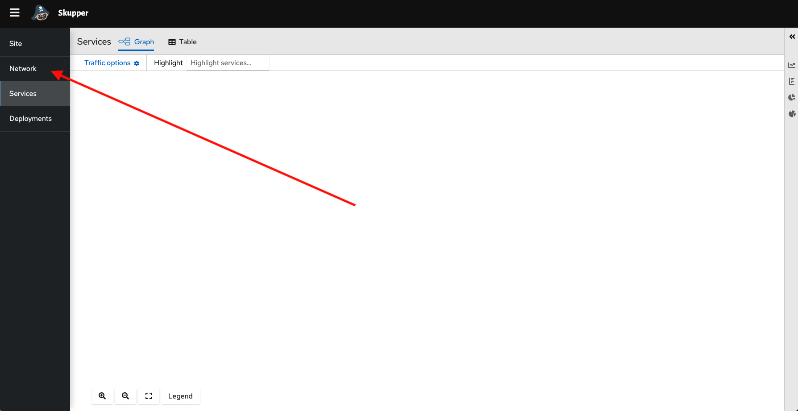

// Attributes
:walkthrough: Connecting applications across clouds with Skupper
:title: Lab 4 - {walkthrough}
:user-password: openshift
:azure-password: azure
:standard-fail-text: Verify that you followed all the steps. If you continue to have issues, contact a workshop assistant.
:namespace: {user-username}
:frontend-namespace: {user-username}-patient-front
:backend-namespace: {user-username}-patient-back
:rhosak: Red Hat OpenShift Streams for Apache Kafka
:rhoas: Red Hat OpenShift Application Services
:cloud-console: https://console.redhat.com
:codeready-project: FleurDeLune

// URLs
:openshift-streams-url: https://console.redhat.com/beta/application-services/streams/kafkas
:next-lab-url: https://tutorial-web-app-webapp.{openshift-app-host}/tutorial/dayinthelife-streaming.git-labs-02-/
:codeready-url: http://codeready-codeready.{openshift-app-host}/
:openshift-console: http://console-openshift-console.{openshift-app-host}/

[id='skupper-gateway']
= {title}

This labs introduces Skupper to create a Virtual Applications Network and create connections across multiple clouds.

*Overview*

This example is a simple database-backed web application that shows how you can use Skupper to access a database at a remote site without exposing it to the public internet.

It contains three services:

- A PostgreSQL database running on a bare-metal or virtual machine in a private data center.
- A payment-processing service running on Kubernetes in a private data center.
- A web frontend service running on Kubernetes in the public cloud. It uses the PostgreSQL database and the payment-processing service.

{blank}

This example uses two different clouds, "aws" and "azure", to represent the multiple Kubernetes clusters in the public cloud.

A quick reminder before you get started. Use the following credentials to login into the OpenShift console:

* Your *username* is: `{user-username}`
* Your *password* is: `{user-password}`

[type=walkthroughResource]
.Red Hat OpenShift Developer Console (AWS)
****
* link:{openshift-host}/topology/ns/{namespace}[Topology View, window="_blank"]
****
[type=walkthroughResource]
.Credentials AWS
****
* *username:* `{user-username}`
* *password:* `{user-password}`
****
[type=walkthroughResource]
.Red Hat OpenShift Developer Console (Azure)
****
* link:{azure-console}/topology/ns/{namespace}[Topology View, window="_blank"]
****
[type=walkthroughResource]
.Credentials Azure
****
* *username:* `{user-username}`
* *password:* `{azure-password}`
****

:secnums:

[time=5]
== Deploy the frontend

You team has already created the first part of your system, the frontend application for Patient Portal. It is time to deploy the application in AWS that will become our _public_ cloud environment.

=== Access the Terminal

1. Access the environment namespace by navigating to the link:{openshift-host}/terminal[AWS terminal console, window="_blank"] in a new browser tab
+
[NOTE]
====
You can also click the Terminal button (*>_*) in the top right corner to open the Terminal panel.
This will open a new panel with a terminal console where we can issue commands to the cluster.
====

2. Wait for the terminal to load, it might take a couple minutes.
+
image:images/001-terminal-loading.png[Loading Terminal]

3. In the new tab, create a new namespace for the frontend by issuing the following command in the Terminal: 
+
[source,bash,subs="attributes+"]
----
oc new-project {frontend-namespace}
----

{blank}

You are now ready to start working on this newly created namespace. 

[NOTE]
====
The terminal have installed all the commands you will be using in this lab.
====

[type=verification]
Were you able to start the terminal?

[type=verificationFail]
{standard-fail-text}

=== Manage Deployment

Time to start deploying the application.

1. Access the developer view console by navigating to the link:{openshift-host}/topology/ns/{frontend-namespace}[AWS developer console, window="_blank"]
2. Click on *Container Iamge*
+
image:images/101-container-image.png[Container Image]
3. We will deploy the image from the development team. Fill in `quay.io/ssorj/patient-portal-frontend` in the *Image name from external registry* section. Click the *Create* button to start the deployment.
+
image:images/102-image-name.png[Image Name]
4. OpenShift will start the deployment. It will take some moments to get to the running state. You will notice it is successful when it turns the surrounding cirle into _dark blue_.
5. Click the _Open URL_ button to access the web application.
+
image:images/103-topology-view.png[Topology View]
6. You will notice the application is not loading correctly as it is not being able to connect to the database and the payments service.
+
image:images/104-patient-portal.png[Patient Portal]

[type=verification]
Did the web application deploy successfully?

[type=verificationFail]
{standard-fail-text}

[time=5]
== Initialize Skupper in AWS Cloud

AWS will be considered our _public_ cloud. So here we will create our public access endpoint for other sites to connect. 

=== Initialize Skupper

This process will install the Skupper router and service controller in the current namespace. 

1. Get back to the terminal tab
2. To initialize Skupper in this namespace you will need to issue the following comand in the terminal window:
+
[source,bash,subs="attributes+"]
----
skupper init --console-auth unsecured
----
+
{blank}
+
[NOTE]
====
Skupper does not need admin rights in the cluster as it is using only ConfigMaps and Secrets. We will use the unsecured console for convience of this lab. 
====
+
You should see a message like the following one.
+
[,bash]
----
Skupper is now installed in namespace 'user1-patient-front'.  Use 'skupper status' to get more information.
----
3. Wait a few moments for the Skupper pods to start. Check they are running with the following command.
+
[source,bash,subs="attributes+"]
----
oc get pods
----
+
{blank}
+
You should see both skupper pods in `Running` status: 
+
[,bash]
----
NAME                                          READY   STATUS    RESTARTS   AGE
patient-portal-frontend-6fc9cdc58d-v6qbh      1/1     Running   0          97m
skupper-router-7449bd7b4-8cnk9                1/1     Running   0          6m54s
skupper-service-controller-78bc5b6cb6-bqd4x   1/1     Running   0          6m52s
----
4. Check the Skupper status with the following command: 
+
[source,bash]
----
skupper status
----
+
{blank}
+
You should see an output similar to the following:
+
[,bash,subs="attributes+"]
----
Skupper is enabled for namespace "{frontend-namespace}" in interior mode. It is not connected to any other sites. It has no exposed services.
The site console url is:  https://skupper-user1-patient-front.{openshift-app-host}
----
5. Copy and paste the console url in a new browser tab.
6. This is the Skupper console. Click on the *Sites* tab to check this site connectivity.
+

7. Your site {frontend-namespace} should be showing here.
+
image:images/201-skupper-site-frontend.png[Skupper Sites]

[type=verification]
Were you able to access the skupper console and see your site there?

[type=verificationFail]
{standard-fail-text}

=== Create a Skupper Access Token

<TODO: explain how tokens work>

Creating a link between Skupper enabled namespaces requires a secret token that allows permission to create the link. The token also carries the link details required for Skupper connection. We will use this token in the remote cluster to link the namespaces.

[NOTE]
====
The link token is truly a secret. Anyone who has the token can link to your namespace. Make sure that only those you trust have access to it.
====

1. First, use the following command in your namespace to generate the token.
+
[source,bash,subs="attributes+"]
----
skupper token create --token-type cert ~/secret-token.yaml
----
2. The previous command creates a YAML file with the link information. Show the contents of the file with the following command: 
+
[source,bash,subs="attributes+"]
----
cat ~/secret-token.yaml
----
3. Take a look at the content, it should have the following structure:
+
[,bash,subs="attributes+"]
----
apiVersion: v1
data:
  ca.crt: LS0tLS1CRUdJTiBDRVJUSUZJQ0FURS0tLS0tCk1JSUREVENDQWZXZ0F3SUJBZ0lRWkRKUWprQ1pmUTNJTlg4RVluR294ekFOQmdrcWhraUc5dzBCQVFzRkFEQWEKTVJnd0ZnWURWUVFERXc5emEz
  ...
  tls.crt: LS0tLS1CRUdJTiBDRVJUSUZJQ0FURS0tLS0tCk1JSUR0RENDQXB5Z0F3SUJBZ0lSQU96bis4eGhCWmREZE5WOWNScjZqN013RFFZSktvWklodmNOQVFFTEJRQXcKR2pFWU1CWUdBMVVFQXhNUGM
  ...
  tls.key: LS0tLS1CRUdJTiBSU0EgUFJJVkFURSBLRVktLS0tLQpNSUlFcFFJQkFBS0NBUUVBdm1xVklvcE5VVmtKc1ZqTmxCN25T
  ...
kind: Secret
metadata:
  annotations:
    edge-host: skupper-edge-{frontend-namespace}.{openshift-app-host}
    edge-port: "443"
    inter-router-host: skupper-inter-router-{frontend-namespace}.{openshift-app-host}
    inter-router-port: "443"
    skupper.io/generated-by: 6b973f04-4125-49a9-84f3-f8d03a1ff843
  creationTimestamp: null
  labels:
    skupper.io/type: connection-token
  name: skupper
type: kubernetes.io/tls
----
+
{blank}
+
[IMPORTANT]
====
Copy and save the content of that file. We are going to use it to connect the Azure namespace to this. 
====

[type=verification]
Do you have your token ready?

[type=verificationFail]
{standard-fail-text}

[time=5]
== Deploy the database

Time to move to the private cloud running on Azure.

=== Access the terminal in Azure

1. Access the environment namespace by navigating to the link:{azure-console}/terminal[Azure terminal console, window="_blank"] in a new browser tab.

2. Open a new browser tab to access the developer view of the link:{openshift-host}/topology/ns/{namespace}[OpenShift console, window="_blank"] running on Azure. This will be considered the _private_ cloud environment.

3. Open a new browser tab to access the developer view of the link:{openshift-host}/topology/ns/{namespace}[OpenShift console, window="_blank"] running on Azure. This will be considered the _private_ cloud environment.

[time=5]
== Deploy the payment processor

[time=5]
== Expose the services

[time=5]
== Initialize Skupper in your cluster

[time=5]
== Link your namespaces

[time=5]
== Test the application