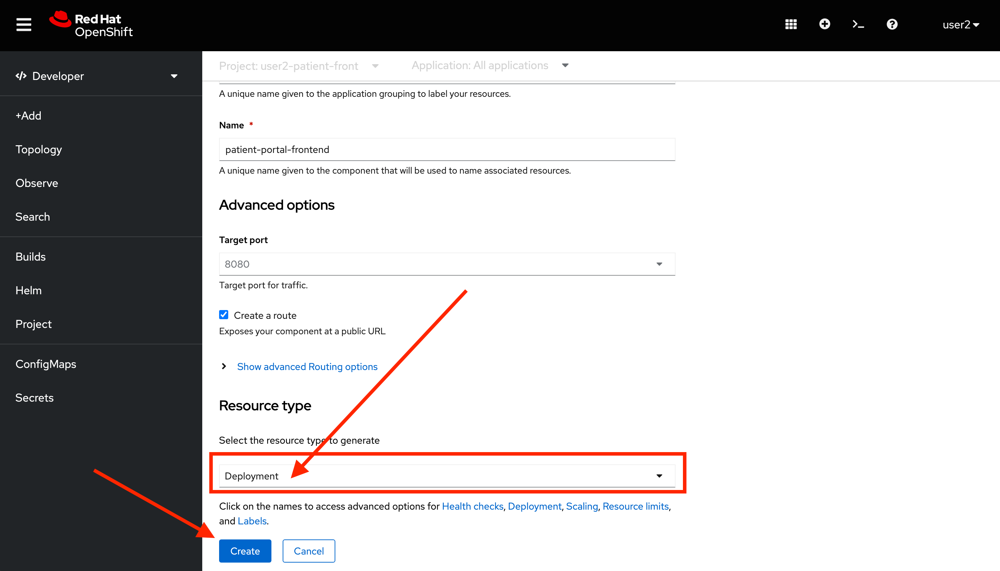
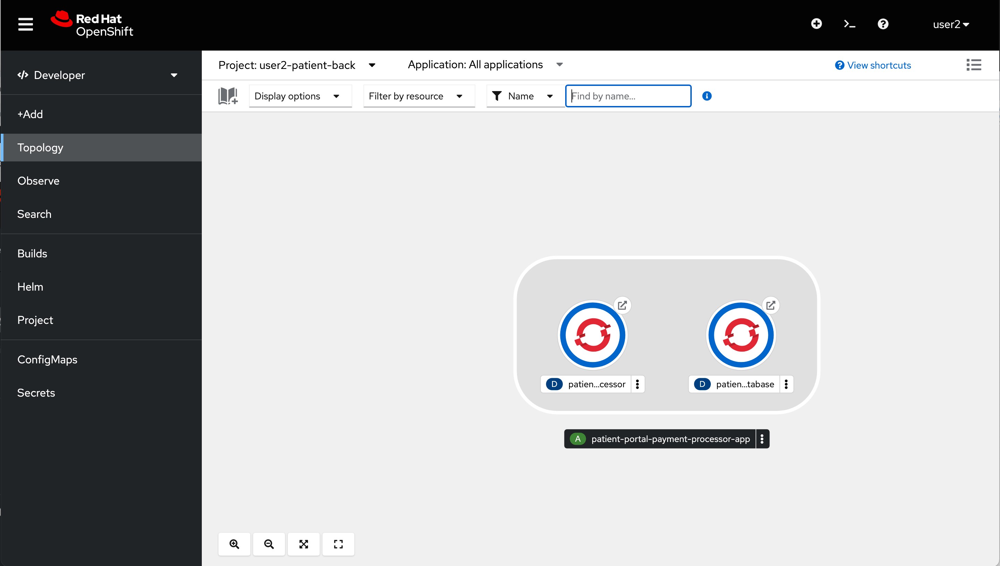
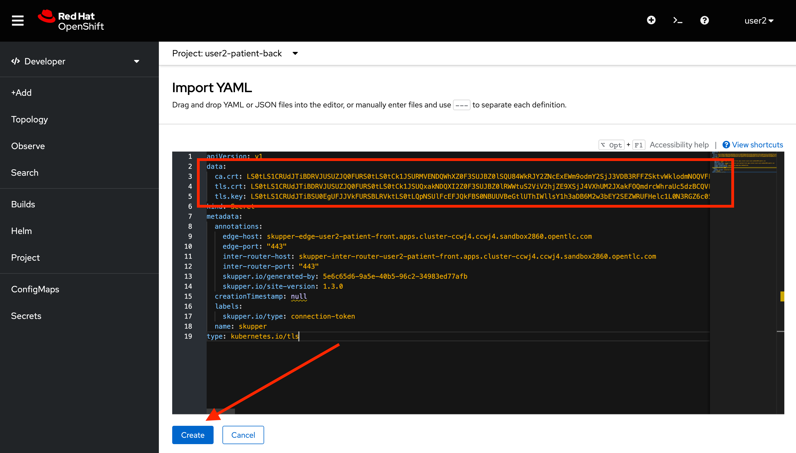
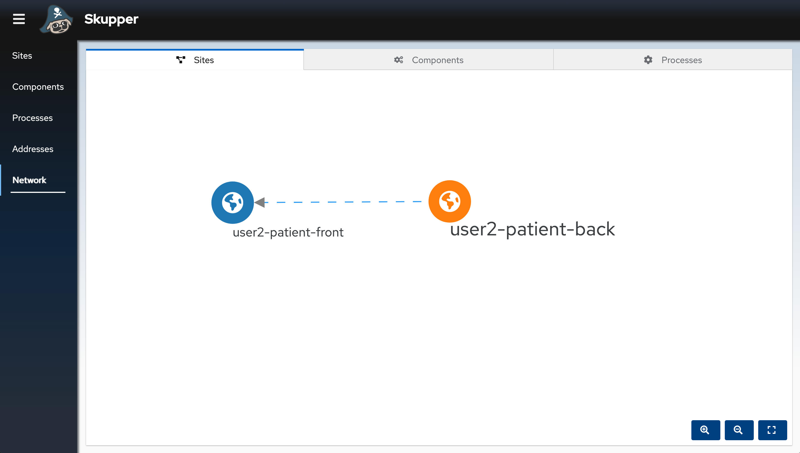

// Attributes
:walkthrough: Connecting applications across clouds with Skupper
:title: Lab 4 - {walkthrough}
:user-password: openshift
:azure-password: azure
:standard-fail-text: Verify that you followed all the steps. If you continue to have issues, contact a workshop assistant.
:namespace: {user-username}
:frontend-namespace: {user-username}-patient-front
:backend-namespace: {user-username}-patient-back
:rhosak: Red Hat OpenShift Streams for Apache Kafka
:rhoas: Red Hat OpenShift Application Services
:cloud-console: https://console.redhat.com
:codeready-project: FleurDeLune

// URLs
:openshift-streams-url: https://console.redhat.com/beta/application-services/streams/kafkas
:next-lab-url: https://tutorial-web-app-webapp.{openshift-app-host}/tutorial/dayinthelife-streaming.git-labs-02-/
:codeready-url: https://devspaces.{openshift-app-host}/
:openshift-console: http://console-openshift-console.{openshift-app-host}/

[id='skupper-gateway']
= {title}

This labs introduces Skupper to create a Virtual Applications Network (also known as a service network) and create connections across multiple clouds.

*Overview*

This example is a simple database-backed web application that shows how you can use Skupper to access a database at a remote site without exposing it to the public internet.

It contains three services:

- A PostgreSQL database running on a bare-metal or virtual machine in a private data center.
- A payment-processing service running on Kubernetes in a private data center.
- A web frontend service running on Kubernetes in the public cloud. It uses the PostgreSQL database and the payment-processing service.

{blank}

This example uses two different clouds, "aws" and "azure", to represent the multiple Kubernetes clusters in the public cloud.

A quick reminder before you get started. Use the following credentials to login into the OpenShift console:

* Your *username* is: `{user-username}`
* Your *password* is: `{user-password}`

[type=walkthroughResource]
.AWS OpenShift Links
****
* link:{openshift-host}/terminal[AWS Terminal Console, window="_blank", , id="resources-codeready-url"]
* link:{openshift-host}/topology/ns/{namespace}[AWS Developer Console, window="_blank"]
****
[type=walkthroughResource]
.AWS Credentials
****
* *username:* `{user-username}`
* *password:* `{user-password}`
****
[type=walkthroughResource]
.Azure OpenShift Links
****
* link:{azure-console}/terminal[Azure Terminal Console, window="_blank", , id="resources-codeready-url"]
* link:{azure-console}/topology/ns/{namespace}[Azure Developer Console, window="_blank"]
****
[type=walkthroughResource]
.Azure Credentials
****
* *username:* `{user-username}`
* *password:* `{azure-password}`
****

:sectnums:

[time=5]
== Deploy the frontend

Your team has already created the first part of your system, the frontend application for Patient Portal. It is time to deploy the application in AWS that will become our _public_ cloud environment.

=== Access the Terminal

1. Access the environment namespace by navigating to the link:{openshift-host}/terminal[AWS terminal, window="_blank"] in a new browser tab
+
[NOTE]
====
You can also click the Terminal button (*>_*) in the top right corner to open the Terminal panel.
This will open a new panel with a terminal console where we can issue commands to the cluster.
====

2. Wait for the terminal to load, it might take a couple minutes.
+
image:images/001-terminal-loading.png[Loading Terminal]

3. In the new tab, create a new namespace for the frontend by issuing the following command in the Terminal: 
+
[source,bash,subs="attributes+"]
----
oc new-project {frontend-namespace}
----
+
{blank}
+
You should see a similar output: 
+
[,bash,subs="attributes+"]
----
Now using project "{frontend-namespace}" on server "https://172.30.0.1:443".

You can add applications to this project with the 'new-app' command. For example, try:

    oc new-app rails-postgresql-example

to build a new example application in Ruby. Or use kubectl to deploy a simple Kubernetes application:

    kubectl create deployment hello-node --image=k8s.gcr.io/serve_hostname
----

{blank}

You are now ready to start working on this newly created namespace. 

[NOTE]
====
All the commands you will be using in this lab are available from the terminal.
====

[type=verification]
Were you able to start the terminal?

[type=verificationFail]
{standard-fail-text}

=== Manage Deployment

Time to start deploying the application.

1. Access the developer view console by navigating to the link:{openshift-host}/topology/ns/{frontend-namespace}[AWS developer console, window="_blank"]
2. Click on *+Add* then click on the *Container images* card.
+
image:images/101-container-image.png[Container Image]
3. We will deploy the image from the development team. Fill in `quay.io/redhatintegration/patient-portal-frontend` in the *Image name from external registry* section. 
+

4. Scroll all the way down and click in the *Resource Type* Link.
+

5. Select *Deployment* as the _Resource Type_ instead of the default Serverless one. Finally, click the *Create* button to start the deployment.
+

6. OpenShift will start the deployment. It will take some moments to get to the running state. You will notice it is successful when it turns the surrounding circle into _dark blue_.
7. Click the _Open URL_ button to access the web application.
+

8. You will notice the application is not loading correctly as it is not being able to connect to the database and the payments service.
+

[type=verification]
Did the web application deploy successfully?

[type=verificationFail]
{standard-fail-text}

[time=5]
== Initialize Skupper in AWS Cloud

AWS will be considered our _public_ cloud. So here we will create our public access endpoint for other sites to connect. 

=== Initialize Skupper

This process will install the Skupper router and service controller in the current namespace. 

1. Get back to the terminal tab
2. First we need to update the frontend environment variables to access the database service with the hostname exposed by skupper. Execute the following command:
+
[source,bash,subs="attributes+"]
----
oc set env deployment/patient-portal-frontend DATABASE_SERVICE_HOST=database
----
3. Now, to initialize Skupper in this namespace you will need to issue the following command in the terminal window:
+
[source,bash,subs="attributes+"]
----
skupper init --enable-console --enable-flow-collector --console-auth unsecured --site-name aws
----
+
{blank}
+
[NOTE]
====
* Skupper does not need admin rights in the cluster as it is using only ConfigMaps and Secrets. 
* We will use the unsecured console for convenience of this lab. 
====
+
You should see a message like the following one.
+
[,bash,subs="attributes+"]
----
Skupper is now installed in the '{user-username}-patient-front' namespace.  Use 'skupper status' to get more information.
----
4. Wait a few moments for the Skupper pods to start. Check they are running with the following command.
+
[source,bash,subs="attributes+"]
----
oc get pods
----
+
{blank}
+
You should see both skupper pods in `Running` status: 
+
[,bash]
----
NAME                                          READY   STATUS    RESTARTS   AGE
patient-portal-frontend-5c988ccdd5-fqj99      1/1     Running   0          42m
skupper-router-f69954856-2cdxv                2/2     Running   0          49s
skupper-service-controller-6c5bb94997-tmpk4   2/2     Running   0          47s
----
5. Check the Skupper status with the following command: 
+
[source,bash]
----
skupper status
----
+
{blank}
+
You should see an output similar to the following:
+
[,bash,subs="attributes+"]
----
Skupper is enabled for namespace "{frontend-namespace}" in interior mode. It is not connected to any other sites. It has no exposed services.
The site console url is:  https://skupper-{frontend-namespace}.{openshift-app-host}
----
6. Copy and paste the console url in a new browser tab.
7. This is the Skupper console. Click on the *Network* tab to check this site connectivity. Your site {frontend-namespace} should be showing here.
+

[type=verification]
Were you able to access the skupper console and see your site there?

[type=verificationFail]
{standard-fail-text}

=== Create a Skupper Access Token

Creating a link between Skupper enabled namespaces requires a secret token that allows permission to create the link. The token carries the link details required for Skupper connection. We will use this token in the remote cluster to link the namespaces.

There are two types of Skupper token:

* **Claim token (default)**
+
A claim token can be restricted by:
+
====
** time - prevents token reuse after a specified period.
** usage - prevents creating multiple links from a single token.
====
+
{blank}
+
All inter-site traffic is protected by mutual TLS using a private, dedicated certificate authority (CA). A claim token is not a certificate, but is securely exchanged for a certificate during the linking process. By implementing appropriate restrictions (for example, creating a single-use claim token), you can avoid the accidental exposure of certificates.

* **Cert token**
+
You can use a cert token to create a link to the site which issued that token, it includes a valid certificate from that site.
+
All inter-site traffic is protected by mutual TLS using a private, dedicated certificate authority (CA). A cert token is a certificate issued by the dedicated CA. Protect it appropriately.

[NOTE]
====
The link token is truly a secret. Anyone who has the token can link to your namespace. Make sure that only those you trust have access to it.
====

1. First, use the following command in your namespace to generate the token.
+
[source,bash,subs="attributes+"]
----
skupper token create --token-type cert ~/secret-token.yaml
----
2. The previous command creates a YAML file with the link information. Show the contents of the file with the following command: 
+
[source,bash,subs="attributes+"]
----
cat ~/secret-token.yaml
----
3. Take a look at the content, it should have the following structure:
+
[,bash,subs="attributes+"]
----
apiVersion: v1
data:
  ca.crt: LS0tLS1CRUdJTiBDRVJUSUZJQ0FURS0tLS0tCk1JSUREVENDQWZXZ0F3SUJBZ0lRWkRKUWprQ1pmUTNJTlg4RVluR294ekFOQmdrcWhraUc5dzBCQVFzRkFEQWEKTVJnd0ZnWURWUVFERXc5emEz
  ...
  tls.crt: LS0tLS1CRUdJTiBDRVJUSUZJQ0FURS0tLS0tCk1JSUR0RENDQXB5Z0F3SUJBZ0lSQU96bis4eGhCWmREZE5WOWNScjZqN013RFFZSktvWklodmNOQVFFTEJRQXcKR2pFWU1CWUdBMVVFQXhNUGM
  ...
  tls.key: LS0tLS1CRUdJTiBSU0EgUFJJVkFURSBLRVktLS0tLQpNSUlFcFFJQkFBS0NBUUVBdm1xVklvcE5VVmtKc1ZqTmxCN25T
  ...
kind: Secret
metadata:
  annotations:
    edge-host: skupper-edge-{frontend-namespace}.{openshift-app-host}
    edge-port: "443"
    inter-router-host: skupper-inter-router-{frontend-namespace}.{openshift-app-host}
    inter-router-port: "443"
    skupper.io/generated-by: 5e6c65d6-9a5e-40b5-96c2-34983ed77afb
    skupper.io/site-version: 1.3.0
  creationTimestamp: null
  labels:
    skupper.io/type: connection-token
  name: skupper
type: kubernetes.io/tls  
----
+
4. Save the content of this file into a file in your local computer. We will be using this in the future.
+
[IMPORTANT]
====
Copy and save the content of that file. We are going to use it to connect the Azure namespace to this. 
====

[type=verification]
Do you have your token ready?

[type=verificationFail]
{standard-fail-text}

[time=5]
== Deploy the Backend Services

Time to move to the private cloud running on Azure. This will be considered the _private_ cloud environment.

=== Access the terminal in Azure

1. Access the environment namespace by navigating to the link:{azure-console}/terminal[Azure terminal console, window="_blank"] in a new browser tab.
+
[NOTE]
====
This is a new cluster, to make a clear distinction you will need to use a different password for this OpenShift Console and Terminal. Your username is the same `{user-username}` and the password is `*{azure-password}*`
====

2. Wait for the terminal to load, it might take a couple minutes.
+
image:images/001-terminal-loading.png[Loading Terminal]

3. In the new tab, create a new namespace for the backend by issuing the following command in the Terminal: 
+
[source,bash,subs="attributes+"]
----
oc new-project {backend-namespace}
----

[type=verification]
Were you able to create the namespace?

[type=verificationFail]
{standard-fail-text}

=== Deploy the payment processor

1. Open a new browser tab to access the developer view of the link:{azure-console}/topology/ns/{backend-namespace}[OpenShift console, window="_blank"] running on Azure.

2. Click on the *Container Image* card button.
+
image:images/300-console-dashboard.png[Dashboard]

3. Type in the payment processor container image name: `quay.io/redhatintegration/patient-portal-payment-processor` and then click *Create*.
+

4. This will start the payment processor in your namespace.

=== Deploy the database

1. Click the *+Add* tab in the top left side of the console to start the process to deploy the database.
+

2. Click on the *Container Image* card button.

3. Type in the database container image name: `quay.io/redhatintegration/patient-portal-database` and then click on *Create*.
+

4. You should now be able to see both deployments in the console.
+

[type=verification]
Do you see both the database and the payment processor deployment?

[type=verificationFail]
{standard-fail-text}

[time=5]
== Expose the Backend Services with Skupper

=== Initialize Skupper in Azure

1. Get back to the link:{azure-console}/terminal[Azure terminal console, window="_blank"].

2. Switch to the working project if you haven't
+
[source,bash,subs="attributes+"]
----
oc project {backend-namespace}
----

3. Initalize Skupper in the namespace by running the following command:
+
[source,bash,subs="attributes+"]
----
skupper init --ingress none --router-mode edge --enable-console=false
----
+
{blank}
+
[NOTE]
====
We are treating this cluster as _private_ and because of that, we are not enabling the console neither the ingress by configuring the router in _edge_ mode.
====
+ 
You should see an output similar to the following: 
+
[,bash,subs="attributes+"]
----
Skupper is now installed in namespace '{backend-namespace}'.  Use 'skupper status' to get more information.
----

4. Wait for the deployments to finish and be in `Running` state.

5. Check the Skupper statust:
+
[source,bash,subs="attributes+"]
----
skupper status
----
+
{blank}
+
You should see an output similar to the following: 
+
[,bash,subs="attributes+"]
----
Skupper is enabled for namespace "{backend-namespace}" in edge mode. It is not connected to any other sites. It has no exposed services.
----

[type=verification]
Is Skupper ready in the Azure cluster?

[type=verificationFail]
{standard-fail-text}

=== Expose the backend services

Time to expose the payment service across the network. 

1. Run the following command to expose the payment service:
+
[source,bash,subs="attributes+"]
----
skupper expose deployment/patient-portal-payment-processor --address payment-processor --protocol http --port 8080
----
+
{blank}
+
You should see an output similar to the following: 
+
[,bash,subs="attributes+"]
----
deployment patient-portal-payment-processor exposed as payment-processor
----

2. Now, expose the database endpoint
+
[source,bash,subs="attributes+"]
----
skupper expose deployment/patient-portal-database --address database --protocol tcp --port 5432
----
+
{blank}
+
You should see an output similar to the following: 
+
[,bash,subs="attributes+"]
----
deployment patient-portal-database exposed as database
----

3. Check that the skupper services were created and binded to the deployments
+
[source,bash,subs="attributes+"]
----
skupper service status
----
+
{blank}
+
You should see an output similar to the following: 
+
[,bash,subs="attributes+"]
----
Services exposed through Skupper:
    payment-processor (http port 8080) with targets
      => app=patient-portal-payment-processor name=patient-portal-payment-processor
    database (tcp port 5432) with targets
      => app=patient-portal-database name=patient-portal-database
----

[type=verification]
Are both services properly configured?

[type=verificationFail]
{standard-fail-text}

[time=5]
== Link the clusters' namespaces

[type=taskResource]
.Skupper
****
* link:https://skupper-{frontend-namespace}.{openshift-app-host}[Skupper Console, window="_blank"]
****

=== Create a Skupper Link

1. Retrieve the token you saved from Task 2. 

2. Get back to the browser tab with the developer view of the link:{azure-console}/topology/ns/{backend-namespace}[OpenShift console, window="_blank"] running on Azure.

3. Click the *+* button on the top menu of the page.
+

4. Paste the file you saved before in the new editor. Click *Create*.
+
[IMPORTANT]
====
Check that the values of the certs are in one single line or you will get an error when trying to create the resource.
====
+

=== Check the connections

1. Get back to the link:https://skupper-{frontend-namespace}.{openshift-app-host}[Skupper console, window="_blank"] and refresh the page.

2. You should be able to see now that the backend cluster is connected to the frontend and that traffic is flowing from one cluster to another.
+

Great! You have now two connected sites ready for your application.

[type=verification]
Do you see both of your namespaces in the Skupper Console?

[type=verificationFail]
{standard-fail-text}

[time=5]
== Test the application

[type=taskResource]
.Patient Portal
****
* link:http://patient-portal-frontend-{frontend-namespace}.{openshift-app-host}[Patient Portal application, window="_blank"]
****

1. Get back to the link:http://patient-portal-frontend-{frontend-namespace}.{openshift-app-host}[Patient Portal application, window="_blank"] tab.

2. Hit Refresh.

3. You should be able to see now the list of patients and doctors!
+

=== Test the payment processor

1. Click on the `Angela Martin` link.

2. Click the *Bills* tab to find the updaid bills.
+

3. Finally, click the *Pay* button.
+
image:images/602-pay-a-bill.png[Pay Bill]

4. Refresh the page. You should be able to see there is now a *Date Paid* value.
+

{blank}

Congratulations! You just deployed a multi cluster application across 2 different clouds.

=== [OPTIONAL]

1. Review the current services available in AWS: 
+
[source,bash,subs="attributes+"]
----
oc get svc
----
+
{blank}
+
You should see an output similar to the following: 
+
[,bash,subs="attributes+"]
----
NAME                      TYPE        CLUSTER-IP       EXTERNAL-IP   PORT(S)               AGE
database                  ClusterIP   172.30.40.93     <none>        5432/TCP              55m
patient-portal-frontend   ClusterIP   172.30.212.153   <none>        8080/TCP              26h
payment-processor         ClusterIP   172.30.133.162   <none>        8080/TCP              55m
skupper                   ClusterIP   172.30.112.48    <none>        8080/TCP,8081/TCP     23h
skupper-router            ClusterIP   172.30.66.96     <none>        55671/TCP,45671/TCP   23h
skupper-router-local      ClusterIP   172.30.239.78    <none>        5671/TCP              23h
----
+
{blank}
+
[NOTE]
====
There are accessible services in the namespace for the _database_ and the _payment-processor_ backend services.
====

2. Now check the pods: 
+
[source,bash,subs="attributes+"]
----
oc get pods
----
+
{blank}
+
You should see an output similar to the following: 
+
[,bash,subs="attributes+"]
----
NAME                                          READY   STATUS    RESTARTS   AGE
patient-portal-frontend-5558d76fd7-nblrr      1/1     Running   0          91m
skupper-router-7744fd48f4-qpz56               1/1     Running   0          23h
skupper-service-controller-569f7dfd7d-r452m   1/1     Running   0          23h
----

{blank}

There is only one pod running on this namespace and this cluster. The backend services are running on Azure!

[type=verification]
Where you able to paid the bill?

[type=verificationFail]
{standard-fail-text}
